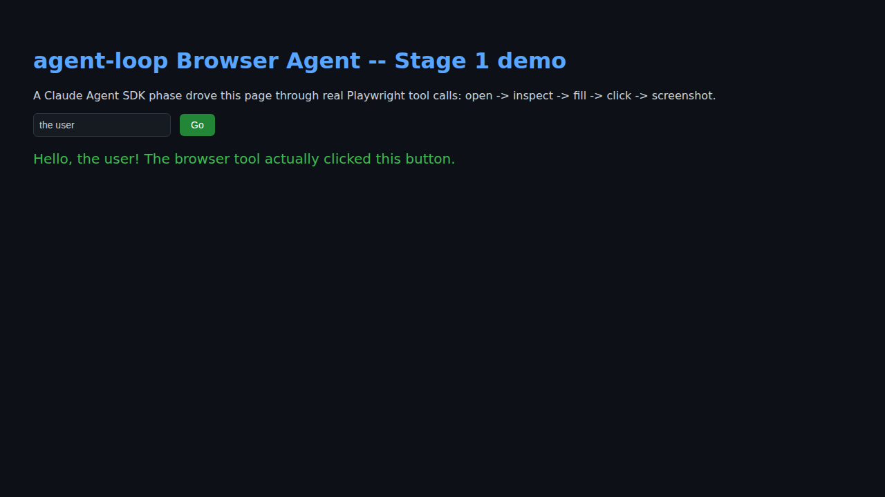
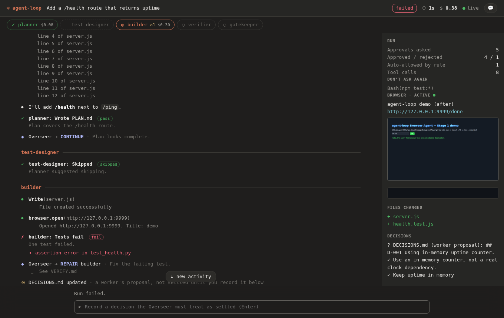

# agent-loop

[](LICENSE)

A multi-agent dev-loop orchestrator built on the real [Claude Agent SDK](https://code.claude.com/docs/en/agent-sdk).
A low-memory **Overseer** drives five specialized worker phases through a task, each phase its own isolated
session, with every tool call streamed live to a browser UI where a human can approve or reject it in real time.

**Why it exists:** to answer one question honestly — *does our `dev-workflow` skill actually work, and how do
we tell?* The live approval UI is the point, not a nice-to-have: watching every step an agent takes, and being
able to say "no, not that," is how the process gets evaluated and improved instead of trusted on faith. This
project always fetches `dev-workflow` fresh from its own public repo (see [Consuming an external
skill](#consuming-an-external-skill-without-coupling-to-it) below) rather than vendoring a copy — the two
projects are independently versioned by design, one general-purpose, one agentic.

## How a run works

```
                                    ┌──────────────┐
   "build me X" ──────────────────▶│   Pipeline   │
                                    └──────┬───────┘
                                           │ strict order, retries on the Overseer's say-so.
                                           │ test-designer is the one phase the Planner can
                                           │ suggest skipping for a genuinely trivial task —
                                           │ pipeline code, not the suggestion, has final say.
        ┌──────────┬──────────────┬───────┴──────┬───────────┬──────────────┐
        ▼          ▼              ▼              ▼           ▼              │
     planner  test-designer    builder        verifier    gatekeeper        │
    (PLAN.md)  (TESTPLAN.md)  (implements)   (VERIFY.md)  (GATEKEEP.md)     │
        │      (skippable)       │              │           │              │
        │          │              │              │           │              │
        └────┬─────┴──────┬───────┴──────┬───────┴─────┬─────┘              │
             ▼                                          each phase ends in a
      short structured verdict                          fenced ```json verdict
      {completed, outcome, headline,                    block — never a raw transcript
       details, concerns, blockingFindings}
             │
             ▼
   ┌───────────────────────────────────────────────────┐
   │                      Overseer                      │  reads only:
   │  reasons over the verdict + prior phase summaries  │   • this phase's verdict
   │  + DECISIONS.md (informal) + trusted decisions      │   • prior phases' short summaries (SQLite)
   │  (human-approved via the UI) — never a full         │   • DECISIONS.md — informal context, not settled
   │  transcript — and returns one of:                  │   • trusted decisions — the only ones treated as settled
   └──────────────┬──────────────────┬───────────────────┘
            continue             repair (a specific        stop
      (only if outcome           phase — same one or
        is "pass"; pipeline      an earlier one — with
        code enforces this       feedback attached),
        regardless of what       bounded by a total
        the Overseer says)       repair budget
```

Every tool call any phase makes, meanwhile, goes through one more gate before it runs:

```
tool call ──▶ PreToolUse hook ──▶ hard-deny safety net (rm -rf /, force-push, …)
                    │
                    ▼
          human-approval UI (WebSocket) ──▶ Approve / Reject, live, in a browser
                    │
                    ▼
              tool actually runs
```

## Why these specific design choices

- **Phases are separate top-level `query()` calls, not SDK subagents.** Subagent delegation in the SDK is
  model-driven, not externally sequenced — this pipeline needs a strict five-step order with retries the
  pipeline code controls, which the SDK's own subagent mechanism doesn't guarantee. Phases hand off through
  files (`PLAN.md`, `TESTPLAN.md`, `VERIFY.md`, `GATEKEEP.md`) plus short indexed SQLite summaries, never
  shared conversation state — each one starts with zero memory of any other phase's session.
- **Every tool call, not just the risky ones, goes through the approval UI.** The SDK's permission evaluation
  runs hooks → deny rules → ask rules → permission mode → allow rules → `canUseTool`, in that order —
  `canUseTool` is *skipped entirely* for anything auto-approved earlier in that chain, which rules it out as
  "the" approval mechanism on its own. A `PreToolUse` hook runs before all of that, unconditionally, for every
  call (`src/hooks.ts`) — the actual reason "every step goes through the UI" is true rather than aspirational.
- **Indexed logs, not RAG.** `src/store.ts` is one SQLite file with FTS5 full-text search over structured rows
  (runs, phases, indexed log lines). No vector embeddings, no similarity search — explicitly out of scope. The
  Overseer and a human query the same short rows: "what did the builder phase do, and why."
- **A run's own history survives even when nobody's watching.** `emitEvent` persists every event to SQLite as
  well as broadcasting it over WebSocket — an unattended run (no browser attached) still leaves a complete,
  queryable record, not just a live feed that vanishes if nobody was connected.
- **Decisions are read, not remembered.** See below.

### Decisions the Overseer reads, not remembers

If a `DECISIONS.md` exists in the working directory — the project-wide decision log `dev-workflow` itself
writes (see its `references/decisions-log-template.md`) — the pipeline reads it after every phase, indexes it,
and passes its current content straight into the Overseer's own prompt (`src/overseer.ts`). A decision a human
actually made (which payment provider, which auth strategy, whatever the real fork was) shouldn't live only
inside whichever phase's one-shot session happened to encounter it and vanish once that process exits. The
Overseer treats every logged entry as settled — not something to relitigate just because a later phase's
concerns mention it again. Worker phases get the same instruction in their own prompts (`src/phases.ts`), so a
real decision is read before any phase decides something is still open, not just fed to the Overseer after.

### Consuming an external skill without coupling to it

`dev-workflow` and `agent-loop` are two independently-versioned repos on purpose — one a general-purpose skill
meant to be usable anywhere, one an agentic environment that consumes and tests it. Nothing in `agent-loop`
hardcodes a path into a sibling checkout of `Dev-Skill`; `test/resolve-skill-source.mjs` instead:

1. Honors `DEV_WORKFLOW_SKILL_PATH` if explicitly set — an opt-in local override for fast iteration while
   developing the skill itself.
2. Otherwise **always shallow-clones the current `dev-workflow` straight from its public GitHub repo** — so
   validation runs against what's actually published right now, not a copy that can silently drift stale.
   `DEV_WORKFLOW_GIT_REF` optionally pins a branch/tag for a reproducible run.

This is what "the base skill upgrades all the time, the agentic side should always pick that up" actually
means in code — not a submodule, not a vendored copy, not a relative path that only works by accident of one
machine's directory layout.

## Layout

| Path | What |
|---|---|
| `src/types.ts` | Shared types: phases, events, verdicts, decisions |
| `src/store.ts` | SQLite + FTS5 store (`node:sqlite`, no native build step) |
| `src/bus.ts` | Event bus: agent events out (persisted *and* broadcast), human approve/deny decisions in |
| `src/hooks.ts` | The `PreToolUse` hooks — the safety net and the approval-UI round-trip |
| `src/phases.ts` | The five phase system prompts + `runPhase()`, the actual `query()` wrapper |
| `src/overseer.ts` | Overseer decision logic (continue / retry / stop), decision-log-aware |
| `src/pipeline.ts` | Sequences the five phases, watches `DECISIONS.md`, applies Overseer decisions |
| `src/env.ts` | The minimal, allowlisted env passed to every phase and the Overseer instead of the full shell env |
| `src/data-dir.ts` | Resolves where the audit database lives — always outside `--dir` |
| `src/server.ts` | HTTP + WebSocket server: broadcasts events, receives decisions |
| `ui/index.html` | The live timeline + Approve/Reject UI (vanilla JS, no build step) |
| `src/cli.ts` | `agent-loop run "<task>"` and `agent-loop insights` entry points |
| `src/text-safety.ts` | Strips terminal control/escape bytes before untrusted text reaches a real terminal — shared by `terminal.ts` and `cli.ts`'s `insights` report |
| `test/approval-server.mjs` | No-LLM test of the approval server's access control (token, Origin, Host) and pending-approval replay |
| `test/tool-and-path-scope.mjs` | No-LLM test of per-phase tool restriction, `--dir` path scoping, and `minimalEnv()` |
| `test/data-dir.mjs` | No-LLM test that the audit database always resolves outside `--dir` |
| `test/plumbing.mjs` | No-LLM test of the store/bus/server/WebSocket round-trip |
| `test/browser-approval.mjs` | Real end-to-end test: a live pipeline run with a real headless-Chromium browser clicking Approve |
| `test/resolve-skill-source.mjs` | Fetches the current `dev-workflow` skill (GitHub by default, local path as opt-in override) |
| `test/validate-dev-workflow.mjs` | The project's actual meta-goal: does `dev-workflow` trigger and get followed on an ordinary request? |
| `test/validate-decisions-log.mjs` | Does a genuinely ambiguous task get asked about once, and never re-asked once logged? |
| `test/insights-cli.mjs` | No-LLM test that `agent-loop insights` strips terminal control bytes from a stored rule before printing it |
| `src/browser-tools.ts` | The 15 browser tools, the per-run session manager, and the local-only network boundary — see [`docs/BROWSER-AGENT.md`](docs/BROWSER-AGENT.md) |
| `test/browser-tools.mjs` | Real-Chromium tests of the original browser tools: containment, the screenshot cap, `close()` never throwing |
| `test/browser-computer-use.mjs` | Real-Chromium tests of refs, screenshot-bound `click_at`/`scroll_at`, tabs, hover/select/scroll, and every leak channel (WebSocket, WebRTC, service worker, popups) against a counted non-allowed host, with a no-defence control run |
| `src/desktop-tools.ts`, `src/desktop-policy.ts`, `src/desktop-driver-cua.ts` | Desktop tools for exactly one human-chosen window: the five tools, the session that fences every action, the denylist and key/text rules, and the narrow adapter over the native driver — see [`docs/DESKTOP-AGENT.md`](docs/DESKTOP-AGENT.md) |
| `test/desktop-tools.mjs`, `test/desktop-adapter.mjs`, `test/desktop-cli.mjs`, `test/desktop-pipeline.mjs` | No-LLM, no-display tests of the desktop controls against a scripted fake driver and a stand-in SDK with traps on every method the adapter must never touch |
| `test/desktop-real.mjs` | The real native driver, real X11 input and a real native window under Xvfb + a window manager, verified through the app's own state file (`npm run test:desktop-real`) |

## Requirements

- **Node.js 22.5+** — required for `node:sqlite` (used for the store, no native build step).
- **git** — the test suite's skill-fetch (`test/resolve-skill-source.mjs`) and repo-seeding shell out to it;
  `agent-loop run` itself doesn't require git unless a task's own steps use it.
- **A working Claude Code CLI authentication.** `@anthropic-ai/claude-agent-sdk` bundles the actual `claude`
  binary (`npm install` alone is enough — nothing extra to install), but that binary still needs to
  authenticate: either an `ANTHROPIC_API_KEY` environment variable, or a machine already logged in via
  `claude login`. **Honest caveat:** every real run behind this project's `STATUS.md` happened *inside* an
  already-authenticated Claude Code session, which passes its own auth through automatically — running
  `agent-loop` from a genuinely clean terminal with only a bare `ANTHROPIC_API_KEY` set has not been
  independently verified here, even though it's how the SDK is documented to work.

### Platform support

Everything in this project's own code goes through Node's cross-platform APIs (`node:path`,
`node:os`'s `homedir()`/`tmpdir()`, the built-in `node:sqlite`) rather than anything Unix-specific, so
the pipeline, the store, the approval server and UI, and the Browser Agent run the same way on
Linux, macOS, and Windows. Two things are worth knowing rather than papering over:

- **The `Bash` tool itself needs a POSIX-ish shell.** That's the Claude Agent SDK/CLI's own
  requirement, not something agent-loop implements — on Windows that means Git Bash or WSL (either
  is enough; a plain `cmd.exe`/PowerShell-only setup isn't). `src/bash-analysis.ts`'s command
  analysis is shell-syntax-aware, not OS-aware, so it behaves identically once a command reaches it
  regardless of which OS is actually running that shell.
- **`dev-workflow`'s git hooks** (`.githooks/pre-commit`, `.githooks/pre-push`) run under Git's own
  bundled `sh`/bash interpreter on every platform (that's how Git for Windows already handles hook
  shebangs), but used to hard-require a `python3` command specifically. Plenty of Windows Python
  installs only add `python`, not `python3`, to `PATH` — confirmed by actually removing `python3`
  from `PATH` and running the old hook (`[dev-workflow] python3 not found`, exit 1) versus the fixed
  one (falls back to `python`, verifies it's really Python 3, succeeds). Both hooks now try `python3`
  then `python`, verifying whichever is found is actually Python 3 before trusting it.

Playwright/Chromium (`--browser`) needs `npx playwright install chromium` on any of the three OSes if
a browser isn't already present — same command everywhere; the sandbox-path fallback in
`launchBrowser()` (`src/browser-tools.ts`) only ever matters inside this project's own dev sandbox and
is inert elsewhere.

## Usage

```bash
npm install
npm run build
node dist/cli.js run "<task description>" [--dir <workDir>] [--browser] [--no-approval] [--strict-approval]
```

You can drive a run from the terminal, the browser, or both. Whichever answers an approval first wins.

- **Terminal:** the run prints a Claude Code-style transcript (`⏺ Bash(npm test)` / `⎿ …`) and asks each
  approval right there: `1` yes, `2` yes and don't ask again, `3` no and tell the agent what to do instead.
- **Browser:** open the printed URL (it ends in `#token=…`, a per-run secret) for the same transcript, plus a
  phase stepper, live cost, the browser preview and a keyboard-driven prompt pinned to the bottom. It
  listens on `127.0.0.1` only and refuses any other website's page. A reload replays the whole run.
- **Afterwards:** every run writes a self-contained `report.html` (the path is printed at the end) with the
  full transcript, costs and, with `--browser`, a video of what the agent did in the app.

Shell commands that only read inside `--dir` (`ls`, `cat`, `grep`, `git status`, `curl` to localhost…) don't
ask, the same way `Read`/`Grep` never did. Pass `--strict-approval` to be asked about every shell command
anyway. `--no-approval` skips approvals entirely; only the safety net still applies.

**[docs/UI.md](docs/UI.md)** has the before/after: real runs went from 53 approval clicks to 13 for the same
task, with screenshots, videos, and exactly which rules can and can't become "don't ask again".

### `agent-loop insights`

```bash
node dist/cli.js insights [--dir <workDir>] [--data-dir <path>]
```

A self-analysis report over every run ever recorded against a `--dir`'s audit database: which
phases get repaired most (and how often), total and per-phase cost, and which "don't ask again"
rules actually get reused versus created once and never touched again. Built entirely from data
already recorded for `run` itself (`src/store.ts`'s `getInsights()`) — nothing new to opt into first,
so it reflects every run's history, not just ones made after some new tracking was added.

## Browser Agent

Phases can drive a real, headless Chromium instance through 15 tools (`src/browser-tools.ts`), registered
as a real in-process MCP server via the SDK's own `createSdkMcpServer`/`tool()`:

- **Navigate and read:** `open`, `inspect`, `wait`, `screenshot`.
- **Act on an element:** `click`, `fill`, `press`, `hover`, `select_option`, `scroll`.
- **Act on a point in a screenshot:** `click_at`, `scroll_at`.
- **Tabs:** `list_tabs`, `switch_tab`, `close_tab`.

`inspect` lists interactive elements with refs like `s1e3`. The element tools take a ref (preferred) or a
CSS selector. Refs and screenshot `snapshotId`s fail closed: once the page has moved on (a newer inspect, a
navigation, a scroll, a resize, a tab switch), they're refused, never silently re-resolved.

Custom tools surface as `mcp__browser__*` in the same `tool_name` field the existing
safety/path-scope/sensitive-file/approval hooks already read. So a browser action gets exactly the same
treatment as `Bash` or `Write`: never auto-approved, always visible in the live UI, always subject to the
safety net. A `BrowserSessionManager` keeps one browser and its tabs alive per run across agent-loop's
separate per-phase SDK sessions.

Only `localhost`/`127.0.0.1` is reachable, from every tab and frame. That's enforced on requests,
WebSockets, WebRTC and service workers, each layer added after a real exploit got through without it.
[`docs/BROWSER-AGENT.md`](docs/BROWSER-AGENT.md) has the full reference and evidence.

Pass `--browser` to `agent-loop run` to give `builder` and `verifier` these tools (off by default). Screenshots
are written outside `--dir`, under `<data dir>/browser-artifacts/<runId>/`, and served read-only at
`/artifacts/<runId>/<file>` — gated by the same per-run token as the WebSocket — so the live UI's **Browser**
panel can show the current page, URL/title, and screenshot as the run progresses.

Real screenshots — not mockups — of both the tools themselves and the full dashboard rendering them:




More real screenshots (as each stage lands) are indexed in [`docs/screenshots/`](docs/screenshots/INDEX.md).

## Desktop Agent

`--desktop-target "<app>"` lets `builder` and `verifier` see and operate **one already-running native
window** you name, through five tools (`capture`, `window_info`, `click`, `type_text`, `key`). Every input
action asks a human first, one at a time, and never offers "don't ask again". It's refused under
`--no-approval`, and refused for terminals, shells, IDEs, launchers, browsers, remote-desktop and
password-manager windows, matched by the owning process rather than the window title. There is no tool to
change the target, touch the clipboard, capture the full screen, or manage other windows or apps.

Each action is tied to the capture it was planned from and uses it up, and the window's identity is
verified before and after every action; a swapped window locks the session. The native driver
(`@trycua/cua-driver`, an optional dependency pinned to an exact version) is only loaded when the flag is
used. The approval prompt shows the window as it was captured with a marker on the exact spot a click would land, and typed text verbatim; there's a side panel with every capture, and `agent-loop insights` counts desktop use. Tested against the real driver on Linux/X11; macOS and Windows are not yet verified. Full reference,
controls and limitations: [`docs/DESKTOP-AGENT.md`](docs/DESKTOP-AGENT.md).
Real session recordings (`.mp4`, click through to view — GitHub still won't autoplay them inline in this
text, but its own file viewer plays them, and any regular media player will too):

- [`docs/media/before-old-ui-real-run-5x.mp4`](docs/media/before-old-ui-real-run-5x.mp4) — the old UI, same
  task, 53 approval clicks, 5× speed.
- [`docs/media/after-new-ui-real-run-5x.mp4`](docs/media/after-new-ui-real-run-5x.mp4) — the current UI, same
  task, 13 approval prompts, 5× speed.
- [`docs/media/agent-browser-session-2x.mp4`](docs/media/agent-browser-session-2x.mp4) — the agent's own
  `--browser` session testing the app it built, 2× speed.

(A real `--browser` run itself still saves its own session recording as `.webm` — Chromium/Playwright's
native recording format — these three are one-time re-encoded copies for easier viewing in the repo.)

Deliberately scoped to local-only for now — `open` refuses anything but `http://localhost`/`127.0.0.1`. A real
domain allowlist, cloud worker isolation, and multi-user auth are later stages, not this one; see
`docs/STRESS-TEST-REPORT.md` for the full staged plan and what's still outstanding.

## Testing

```bash
npm run build
npm test                       # all of the no-API suites below, in one go (what CI runs)
npm run test:plumbing          # no LLM calls — store/bus/server/WebSocket wiring only
npm run test:server            # no LLM calls — approval server access control + approval replay
npm run test:scope             # no LLM calls — per-phase tool restriction, --dir path scoping, minimal env
npm run test:data-dir          # no LLM calls — audit database location stays outside --dir
npm run test:browser-tools     # no LLM calls — real Chromium, real DOM changes, real screenshot files
npm run test:ui                # no LLM calls — real Chromium drives the real UI: stepper, keyboard approvals, replay
npm run test:terminal          # no LLM calls — the terminal transcript + prompt, driven with real keypresses
npm run test:bash              # no LLM calls — which shell commands are read-only / get which "don't ask again" rule
npm run test:rules             # no LLM calls — "don't ask again" never stretches past what you saw
npm run test:report            # no LLM calls — the saved report.html opens from disk, inert against injected HTML
node test/e2e/record-run.mjs --out <dir> [--browser] [--smart] -- "<task>"   # real API calls — records a whole run as video
node test/browser-approval.mjs # real API calls — full pipeline, real browser, real Approve clicks
node test/validate-dev-workflow.mjs   # real API calls — does dev-workflow actually trigger + get followed?
node test/validate-decisions-log.mjs  # real API calls — ask once, never re-ask what's already decided
```

Every `test/validate-*` and `test/browser-approval.mjs` script spends real API tokens — they exist because
reading the code isn't evidence something works.

## Status

See `STATUS.md` for the current, evidence-based state: what's been actually run and independently verified vs.
what's still untested. Nothing here is claimed to work from reading the code — every claim has a run ID, a
command, or a file behind it.

## Related projects

[**dev-workflow**](https://github.com/noobhacker02/Dev-Skill) is the general-purpose spec-first development
skill this project exists to test and improve — see [Consuming an external
skill](#consuming-an-external-skill-without-coupling-to-it) above for how the two stay independently versioned.

## License

[MIT](LICENSE)
