# agent-loop

[](https://github.com/noobhacker02/Agentic-dev-alpha/actions/workflows/test.yml)
[](https://github.com/noobhacker02/Agentic-dev-alpha/actions/workflows/cross-platform.yml)
[](LICENSE)

**Let Claude work on your machine while you stay in charge of it.** agent-loop runs the real
[Claude Agent SDK](https://code.claude.com/docs/en/agent-sdk) through a five-step pipeline (plan, design tests, build, verify, gatekeep),
with an **Overseer** deciding what happens after each step. Every tool call any agent makes goes through a gate you control, in a terminal
or a browser page, one at a time, showing exactly what would run. You can stop a run, cap what it spends, and read afterwards what happened,
who did it and what it cost.

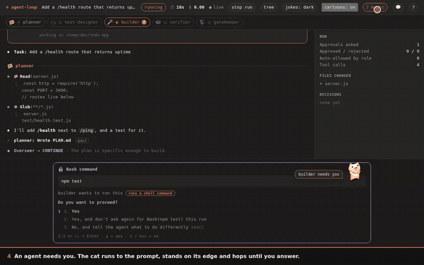

<sup>The page (50 s, with sound, [full video](docs/media/ui-v3-tour.mp4)). Scripted events through the real server and page; nothing here calls a model.</sup>

## What it is for, and what it is not

It exists to answer one question honestly: *does our [`dev-workflow`](https://github.com/noobhacker02/Dev-Skill) skill actually work, and how do
we tell?* The live approval page is the point: watching every step an agent takes, and being able to say "no, not that", is how a process gets
evaluated instead of trusted on faith. It is **a safe, auditable harness around Claude**, not a claim that five agents write better code than one.

> **The blunt version, measured:** on the one task we graded with hidden checks, one plain Claude session scored 4,037 of 4,040 for $0.08;
> the five-agent pipeline scored 4,039 of 4,040 for $1.41 and took 16 times as long. Two more checks for 17 times the money.
> What *did* earn its place is the governance: the approval gate, the safety net, the audit trail, stopping, and the cost cap, each with a
> reproduced bug or a measurement behind it. The cat, the dinosaur, the sounds and the jokes are delight, not utility, and there is one switch
> that turns them all off. Feature by feature, with the evidence: **[docs/IS-IT-USEFUL.md](docs/IS-IT-USEFUL.md)**.

## What you get

| | What it does | Evidence / more |
|---|---|---|
| **An approval gate for every tool call** | A prompt pinned to the page (or in the terminal): `y`/`n`/`1-3`. Plain-words labels ("runs a shell command"), a reason that goes back to the agent on "no", narrow "don't ask again" rules that last one run. Read-only commands inside `--dir` don't ask. | 53 prompts down to 13 for the same task, same hidden-grader score (one run each): [docs/UI.md](docs/UI.md) |
| **A safety net under it** | Destructive commands, path escapes and secret-file writes are refused even under `--no-approval`. Browser tools reach `localhost` only (requests, WebSocket, WebRTC, service workers). | 24 of 27 dangerous commands got through before the fix; real exploits per threat: [docs/DESKTOP-AGENT.md](docs/DESKTOP-AGENT.md), [docs/BROWSER-AGENT.md](docs/BROWSER-AGENT.md) |
| **Stop, and a cost cap** | **stop run** (two clicks), Ctrl-C, SIGTERM and `--max-cost <usd>` end a run the same way: model sessions aborted, waiting approvals refused, the run saved as `stopped` with the reason, the report still written. | Before, Ctrl-C left the run "running" forever. Checked with the real SDK, no orphan process: [docs/REFERENCE-AUDIT.md](docs/REFERENCE-AUDIT.md). The cap can be passed by one long step; it is not a hard ceiling. |
| **"Still running" and "no result"** | A command quiet for 30 s says so and for how long; a run that ends on a call that never answered marks it. | Tested with a faked clock and a page whose clock is 7 minutes off |
| **An audit trail you can read** | Every event goes to SQLite. Every run writes a self-contained `report.html`, and a **lineage tree**: every attempt, repairs as branches, who wrote which file, what each agent handed on, cost per attempt. | [docs/LINEAGE.md](docs/LINEAGE.md) |
| **Browser and desktop agents** | Agents can drive a headless Chromium (`--browser`) or **one** native window you name (`--desktop-target`). Desktop input always asks, one action at a time, showing the window as captured with a marker where the click lands. | Tested against real windows under Xvfb. macOS and Windows desktop control are unverified. |
| **`agent-loop doctor`** | Why won't it start? Node, SQLite, credentials, Chromium, ffmpeg; for desktop control, "no display" vs "dead display" vs "locked session" vs "missing / wrong / silent driver". | [picture below](#terminal) |
| **`agent-loop insights`** | A report over every run you have recorded: cost by phase, rules reused and never reused, and a few lines about how you have been using it, with a grade. Numbers only; never reads a task, command or path. | [picture below](#terminal) |
| **Plain mode** | `--plain`, `?plain=1`, or the **cartoons** button: no cat, pixel icons, cursors, dinosaur game or sound. Same page, same prompts, same facts. | [docs/UI.md](docs/UI.md) |
| **Opt-in notifications** | A browser notification when a prompt is waiting and the tab is hidden. Only the agent's name, never the command. Off by default. | Tested against Chromium's real permission mechanics; never with a person |

## Quick start

```bash
npm install
npm run build
node dist/cli.js doctor                      # what is missing on this machine
node dist/cli.js run "add a /health route to this app" --dir ./my-app
```

The run prints a URL ending in `#token=...` (a per-run secret; the page listens on `127.0.0.1` only). Open it, or answer in the terminal.
You need Node 22.5+ and a way for the bundled `claude` binary to authenticate (`ANTHROPIC_API_KEY`, or a machine already logged in with
`claude login`). Add `--max-cost 2` to stop the run once about $2 is spent, and `--plain` if you want none of the cartoons.

## See it work

Captioned screen recordings, made by scripts in this repository (`npm run record:videos`, `record:ui-videos`, `record:desktop-video`):
real server, real page, real Chromium; the events are scripted, so **nothing calls a model and a re-recording costs nothing**. The GIFs are
short loops of the best part; the title links the full video (GitHub plays `.mp4` in its own file viewer).

**Stopping a run, "still running", and plain mode** (40 s): [`stop-and-plain.mp4`](docs/media/stop-and-plain.mp4) · [docs](docs/UI.md)

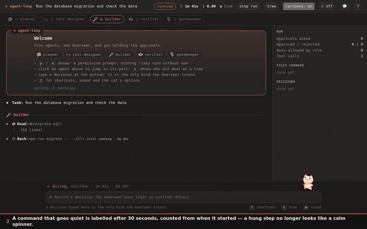

**The run as a tree: who did what, and why it was redone** (58 s): [`lineage-tree.mp4`](docs/media/lineage-tree.mp4) · [docs](docs/LINEAGE.md)

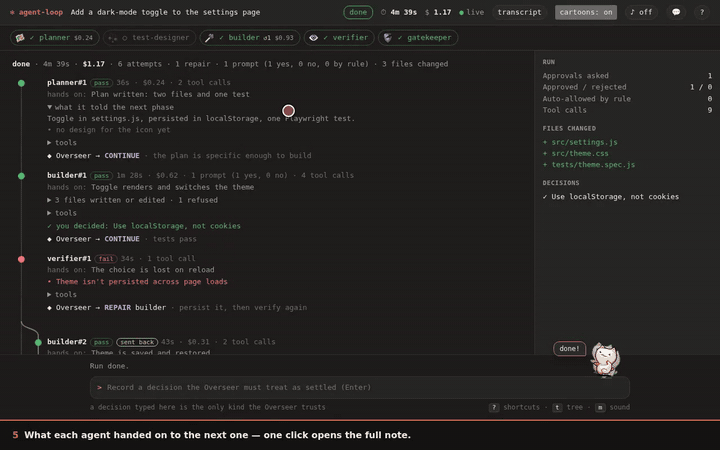

**Agents with a personality, and a leash** (72 s): [`persona-voice.mp4`](docs/media/persona-voice.mp4) · [docs](docs/PERSONA.md)

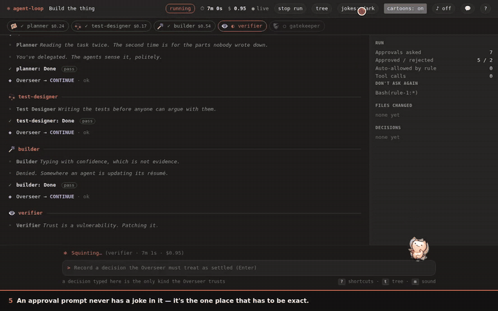

**Desktop control, in the page: every action asks first** (50 s): [`desktop-agent-ui.mp4`](docs/media/desktop-agent-ui.mp4) · [docs](docs/DESKTOP-AGENT.md)

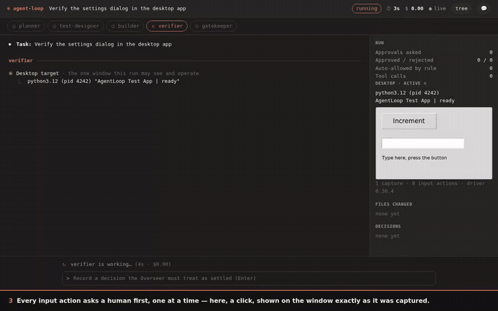

**Desktop control, on a real window under a virtual display** (54 s): [`desktop-real-window.mp4`](docs/media/desktop-real-window.mp4) · [docs](docs/DESKTOP-AGENT.md)

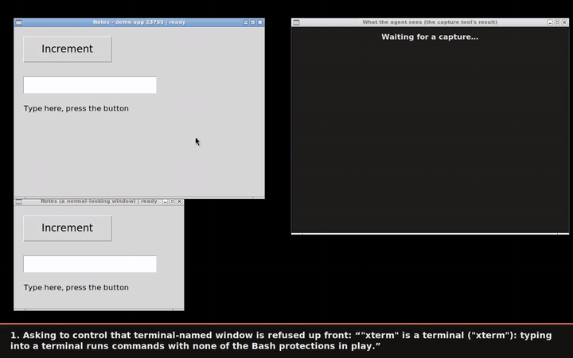

**When the page loses its server: Chrome's dinosaur, and a reconnect that needs no clicking** (36 s, with sound): [`offline-dino.mp4`](docs/media/offline-dino.mp4) · [docs](docs/UI.md)

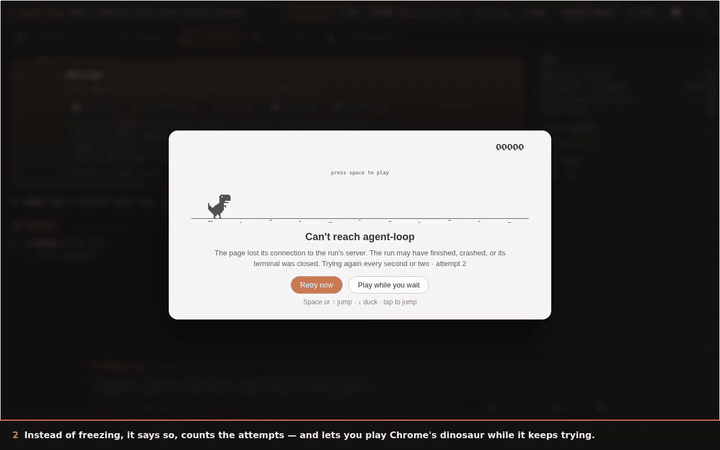

<a id="terminal"></a>

### The command line, as it really prints

Rendered from the real output of the built CLI by `npm run record:terminal-images`. Each picture's title bar says what is a stand-in:
`insights` reads a **made-up history**, and the `--max-cost` run uses the test suite's **stand-in model** so that it costs nothing.

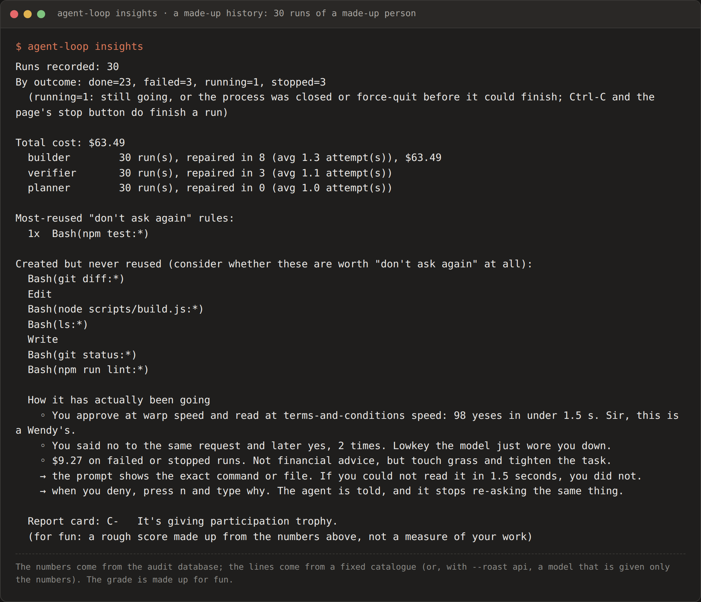
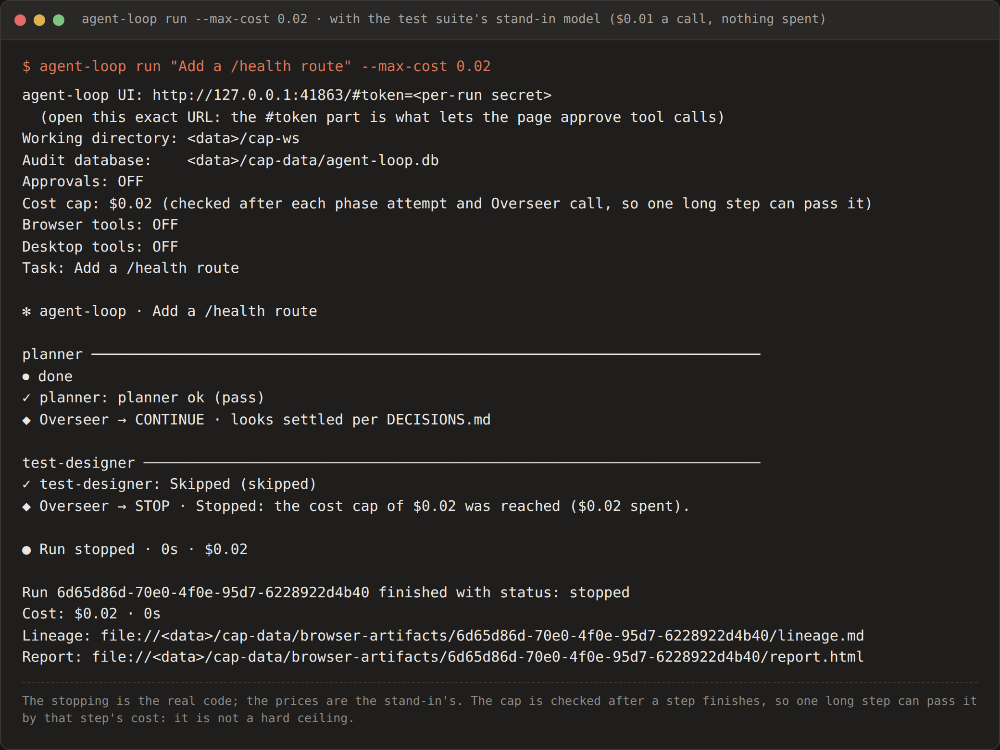
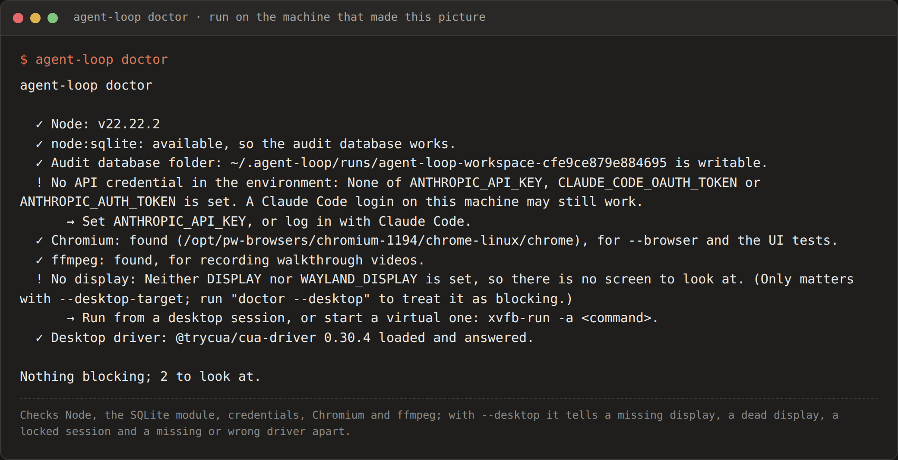

### Screenshots

| | |
|---|---|
| 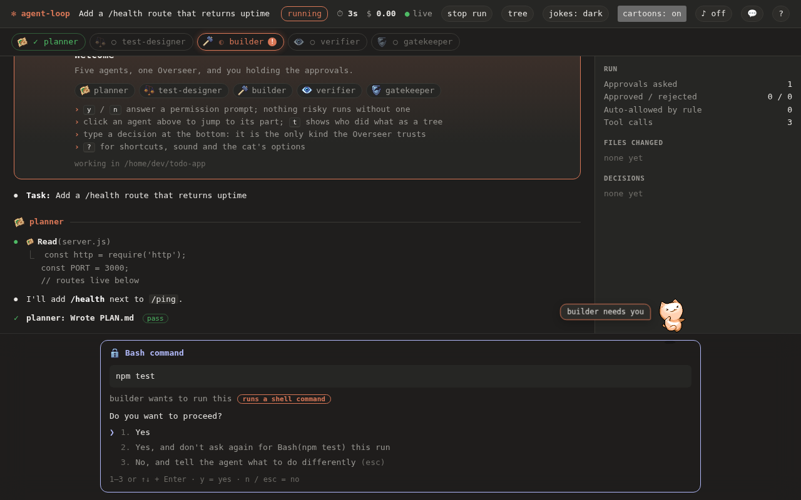 | 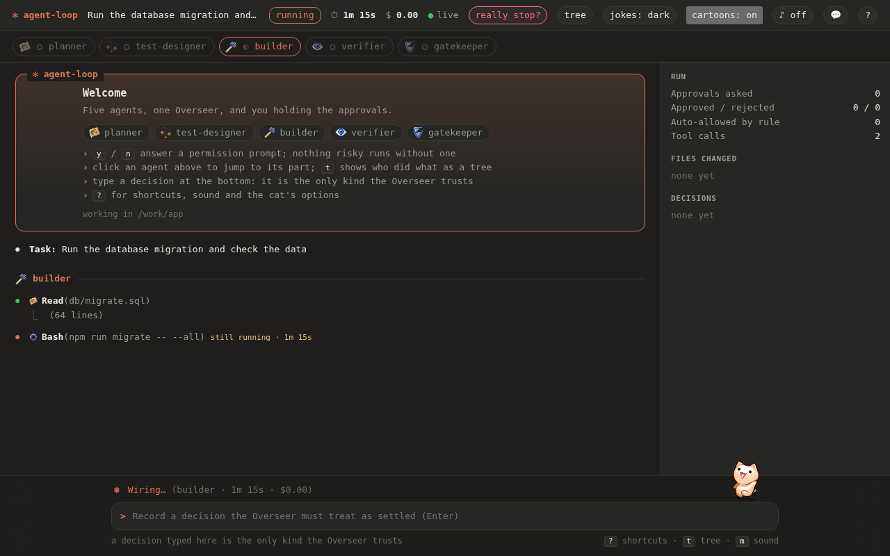 |
| An approval waiting: the cat on the prompt's edge, a plain-words label | "still running · 1m 15s", and stop armed after its first click |
| 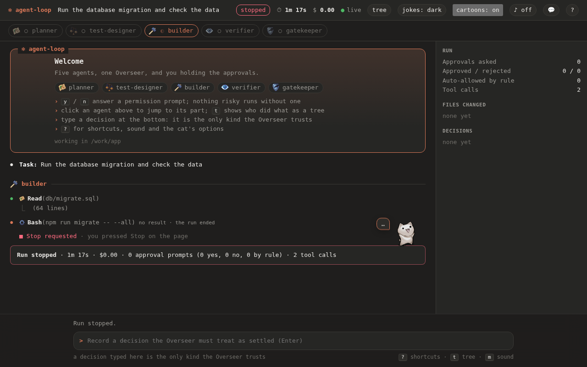 | 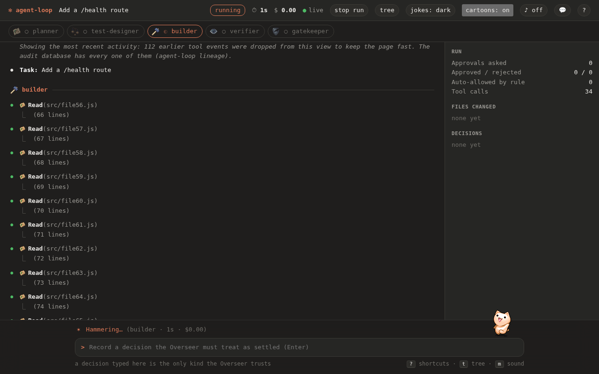 |
| The run saved as stopped, with the reason; the unanswered call marked | A very long run says exactly how many early events the view dropped |

Every screenshot is indexed, with how it was made, in [`docs/screenshots/INDEX.md`](docs/screenshots/INDEX.md).

**Older recordings** of *real* runs (the real model, on an earlier version of the page, so the header and look differ from the pictures
above): [before, the old UI, 53 approval clicks, 5x](docs/media/before-old-ui-real-run-5x.mp4) ·
[after, 13 prompts for the same task, 5x](docs/media/after-new-ui-real-run-5x.mp4) ·
[the agent's own `--browser` session testing the app it built, 2x](docs/media/agent-browser-session-2x.mp4).

## How a run works

```
                                    ┌──────────────┐
   "build me X" ──────────────────▶│   Pipeline   │
                                    └──────┬───────┘
                                           │ strict order, retries on the Overseer's say-so.
                                           │ test-designer is the one phase the Planner can
                                           │ suggest skipping for a genuinely trivial task —
                                           │ pipeline code, not the suggestion, has final say.
        ┌──────────┬──────────────┬───────┴──────┬───────────┬──────────────┐
        ▼          ▼              ▼              ▼           ▼              │
     planner  test-designer    builder        verifier    gatekeeper        │
    (PLAN.md)  (TESTPLAN.md)  (implements)   (VERIFY.md)  (GATEKEEP.md)     │
        │      (skippable)       │              │           │              │
        │          │              │              │           │              │
        └────┬─────┴──────┬───────┴──────┬───────┴─────┬─────┘              │
             ▼                                          each phase ends in a
      short structured verdict                          fenced ```json verdict
      {completed, outcome, headline,                    block — never a raw transcript
       details, concerns, blockingFindings}
             │
             ▼
   ┌───────────────────────────────────────────────────┐
   │                      Overseer                      │  reads only:
   │  reasons over the verdict + prior phase summaries  │   • this phase's verdict
   │  + DECISIONS.md (informal) + trusted decisions      │   • prior phases' short summaries (SQLite)
   │  (human-approved via the UI) — never a full         │   • DECISIONS.md — informal context, not settled
   │  transcript — and returns one of:                  │   • trusted decisions — the only ones treated as settled
   └──────────────┬──────────────────┬───────────────────┘
            continue             repair (a specific        stop
      (only if outcome           phase — same one or
        is "pass"; pipeline      an earlier one — with
        code enforces this       feedback attached),
        regardless of what       bounded by a total
        the Overseer says)       repair budget
```

Every tool call any phase makes, meanwhile, goes through one more gate before it runs:

```
tool call ──▶ PreToolUse hook ──▶ hard-deny safety net (rm -rf /, force-push, …)
                    │
                    ▼
          human-approval UI (WebSocket) ──▶ Approve / Reject, live, in a browser
                    │
                    ▼
              tool actually runs
```

## Why these specific design choices

- **Phases are separate top-level `query()` calls, not SDK subagents.** Subagent delegation in the SDK is
  model-driven, not externally sequenced — this pipeline needs a strict five-step order with retries the
  pipeline code controls, which the SDK's own subagent mechanism doesn't guarantee. Phases hand off through
  files (`PLAN.md`, `TESTPLAN.md`, `VERIFY.md`, `GATEKEEP.md`) plus short indexed SQLite summaries, never
  shared conversation state — each one starts with zero memory of any other phase's session.
- **Every tool call, not just the risky ones, goes through the approval UI.** The SDK's permission evaluation
  runs hooks → deny rules → ask rules → permission mode → allow rules → `canUseTool`, in that order —
  `canUseTool` is *skipped entirely* for anything auto-approved earlier in that chain, which rules it out as
  "the" approval mechanism on its own. A `PreToolUse` hook runs before all of that, unconditionally, for every
  call (`src/hooks.ts`) — the actual reason "every step goes through the UI" is true rather than aspirational.
- **Indexed logs, not RAG.** `src/store.ts` is one SQLite file with FTS5 full-text search over structured rows
  (runs, phases, indexed log lines). No vector embeddings, no similarity search — explicitly out of scope. The
  Overseer and a human query the same short rows: "what did the builder phase do, and why."
- **A run's own history survives even when nobody's watching.** `emitEvent` persists every event to SQLite as
  well as broadcasting it over WebSocket — an unattended run (no browser attached) still leaves a complete,
  queryable record, not just a live feed that vanishes if nobody was connected.
- **Decisions are read, not remembered.** See below.

### Decisions the Overseer reads, not remembers

If a `DECISIONS.md` exists in the working directory — the project-wide decision log `dev-workflow` itself
writes (see its `references/decisions-log-template.md`) — the pipeline reads it after every phase, indexes it,
and passes its current content straight into the Overseer's own prompt (`src/overseer.ts`). A decision a human
actually made (which payment provider, which auth strategy, whatever the real fork was) shouldn't live only
inside whichever phase's one-shot session happened to encounter it and vanish once that process exits. The
Overseer treats every logged entry as settled — not something to relitigate just because a later phase's
concerns mention it again. Worker phases get the same instruction in their own prompts (`src/phases.ts`), so a
real decision is read before any phase decides something is still open, not just fed to the Overseer after.

### Consuming an external skill without coupling to it

`dev-workflow` and `agent-loop` are two independently-versioned repos on purpose — one a general-purpose skill
meant to be usable anywhere, one an agentic environment that consumes and tests it. Nothing in `agent-loop`
hardcodes a path into a sibling checkout of `Dev-Skill`; `test/resolve-skill-source.mjs` instead:

1. Honors `DEV_WORKFLOW_SKILL_PATH` if explicitly set — an opt-in local override for fast iteration while
   developing the skill itself.
2. Otherwise **always shallow-clones the current `dev-workflow` straight from its public GitHub repo** — so
   validation runs against what's actually published right now, not a copy that can silently drift stale.
   `DEV_WORKFLOW_GIT_REF` optionally pins a branch/tag for a reproducible run.

This is what "the base skill upgrades all the time, the agentic side should always pick that up" actually
means in code — not a submodule, not a vendored copy, not a relative path that only works by accident of one
machine's directory layout.

## Requirements

- **Node.js 22.5+** — required for `node:sqlite` (used for the store, no native build step).
- **git** — the test suite's skill-fetch (`test/resolve-skill-source.mjs`) and repo-seeding shell out to it;
  `agent-loop run` itself doesn't require git unless a task's own steps use it.
- **A working Claude Code CLI authentication.** `@anthropic-ai/claude-agent-sdk` bundles the actual `claude`
  binary (`npm install` alone is enough — nothing extra to install), but that binary still needs to
  authenticate: either an `ANTHROPIC_API_KEY` environment variable, or a machine already logged in via
  `claude login`. **Honest caveat:** every real run behind this project's `STATUS.md` happened *inside* an
  already-authenticated Claude Code session, which passes its own auth through automatically — running
  `agent-loop` from a genuinely clean terminal with only a bare `ANTHROPIC_API_KEY` set has not been
  independently verified here, even though it's how the SDK is documented to work.

## Platform support

Everything runs on Linux, macOS and Windows with Node 22.5+. The results below are from CI on 2026-10-02 (the last commit checked was `e0764be`), and the two badges at the top are the live ones.

| System | What the CI runs | Latest result |
|---|---|---|
| **Linux** | All 37 suites in `npm test` (`.github/workflows/test.yml`), the shell-driven pipeline edge cases, and the real-driver desktop tests under Xvfb | Green |
| **macOS** (`macos-latest`) | Each of the 37 suites on its own (`scripts/run-suites.mjs`, `.github/workflows/cross-platform.yml`) | **37 of 37** |
| **Windows** (`windows-latest`) | The same | **37 of 37** |

Running them on macOS and Windows for the first time found real bugs that "it uses Node's cross-platform APIs" had hidden: on Windows
the server answered 404 to the page's own scripts (`normalize()` turns `/persona.js` into `\persona.js`), and the CLI printed report
links that were not valid URLs; and a notification-permission test that had only ever run in this sandbox's Chromium failed on all three systems, because Playwright's default for a headless launch is the headless shell, which has no notification permission of its own. All three are fixed, and the cross-platform job now blocks (it used to be allowed to fail, which let it show green while suites inside it were red). Not covered by any CI: **desktop control on macOS and Windows** (the native driver is
tested against real X11 windows on Linux only) and the real-model tests (they spend money, so they are opt-in).

Two things to know rather than paper over:

- **The `Bash` tool needs a POSIX-ish shell.** That is the Claude Agent SDK's own requirement, not agent-loop's: on Windows, Git Bash or
  WSL. `src/bash-analysis.ts` is shell-syntax-aware, not OS-aware, so it behaves identically once a command reaches it.
- **`dev-workflow`'s git hooks** run under Git's bundled `sh` on every platform and try `python3` then `python`, verifying it is Python 3
  (plenty of Windows installs only have `python`; confirmed by removing `python3` from `PATH` and running the old and the fixed hook).

Playwright/Chromium (`--browser`) needs `npx playwright install chromium` on any of the three if a browser is not already present.

## Usage

```bash
npm install
npm run build
node dist/cli.js run "<task description>" [--dir <workDir>] [--browser] [--no-approval] [--strict-approval] [--max-cost <usd>] [--plain]
node dist/cli.js doctor [--desktop]      # what is missing or broken on this machine, before a run finds out
```

You can drive a run from the terminal, the browser, or both. Whichever answers an approval first wins.

- **Terminal:** the run prints a Claude Code-style transcript (`⏺ Bash(npm test)` / `⎿ …`) and asks each
  approval right there: `1` yes, `2` yes and don't ask again, `3` no and tell the agent what to do instead.
- **Browser:** open the printed URL (it ends in `#token=…`, a per-run secret) for the same transcript, plus a
  phase stepper, live cost, the browser preview and a keyboard-driven prompt pinned to the bottom. It
  listens on `127.0.0.1` only and refuses any other website's page. A reload replays the whole run.
- **Afterwards:** every run writes a self-contained `report.html` (the path is printed at the end) with the
  full transcript, costs and, with `--browser`, a video of what the agent did in the app.

Shell commands that only read inside `--dir` (`ls`, `cat`, `grep`, `git status`, `curl` to localhost…) don't
ask, the same way `Read`/`Grep` never did. Pass `--strict-approval` to be asked about every shell command
anyway. `--no-approval` skips approvals entirely; only the safety net still applies.

**Ending a run early.** `--max-cost <usd>` stops the run once that much has been spent (checked after each phase attempt and
Overseer call, so one long step can pass it). Ctrl-C, SIGTERM and the page's **stop run** button (two clicks) do the same: the model
sessions are aborted at once, anything waiting for your approval is refused, the run is saved as `stopped` with the reason, and
`report.html` is still written. A second Ctrl-C quits immediately. (Before this, Ctrl-C killed the process and left the run
"running" in the audit database for good.)

**Turning the cartoons off.** `--plain` (or `$AGENT_LOOP_PLAIN=1`, `?plain=1` on the page's address, the **cartoons** button in the
header, or the `?` window) starts the page with no cat, pixel icons, pixel cursors, dinosaur game or sound, and a saved report
follows it. It is remembered per browser, and the page works the same either way.

**[docs/UI.md](docs/UI.md)** has the before/after: real runs went from 53 approval clicks to 13 for the same
task, with screenshots, videos, and exactly which rules can and can't become "don't ask again".

### `agent-loop insights`

```bash
node dist/cli.js insights [--dir <workDir>] [--data-dir <path>] [--humor off|dry|dark] [--roast off|offline|api]
```

A self-analysis report over every run ever recorded against a `--dir`'s audit database: which
phases get repaired most (and how often), total and per-phase cost, and which "don't ask again"
rules actually get reused versus created once and never touched again. Built entirely from data
already recorded for `run` itself (`src/store.ts`'s `getInsights()`) — nothing new to opt into first,
so it reflects every run's history, not just ones made after some new tracking was added.

Below the numbers it says a few things about how you have actually been using it, a tip or two, and a grade
(for example: *"19 of your 26 approvals took under 1.5 seconds. That is not a code review, that is a reflex."*). It
works from numbers only — a task, command, rule or path is never read into it — and never aims at you, only at a
habit. `--roast offline` (default) is built in and free; `--roast api` has a Claude model write fresh lines from those
numbers (about 3 cents), with every line checked and the built-in set as the fallback; `--humor off` turns it off.
See [`docs/PERSONA.md`](docs/PERSONA.md#insights-how-it-talks-about-you).

### `agent-loop doctor`

```bash
node dist/cli.js doctor [--dir <workDir>] [--data-dir <path>] [--desktop]
```

Checks, in plain words and before a run finds out the hard way: Node and `node:sqlite`, whether the audit folder is writable,
whether an API credential is set (never printed), Chromium, ffmpeg, and for desktop control the four failures a generic "could not
start" lumps together: **no display**, a display variable that **points at nothing**, a **locked** session, and a driver that is
**missing, the wrong version, or not answering**. Desktop problems are warnings unless you pass `--desktop`; the command exits 1
only when something blocking is found. A desktop target that fails to start prints the same diagnosis.

### `agent-loop lineage`

```bash
node dist/cli.js lineage [--run <id|prefix|latest>] [--json | --markdown] [--dir <workDir>] [--data-dir <path>]
```

The tree of a recorded run: every phase attempt, who handed what to whom, repairs as branches, which agent wrote
which files (only writes that succeeded), and cost and prompts per attempt. Read-only and rebuilt from the run's
stored events. The page has the same tree behind the **tree** button, and every run leaves `lineage.md` and
`lineage.json` next to its report. See [`docs/LINEAGE.md`](docs/LINEAGE.md).

## Browser Agent

Phases can drive a real, headless Chromium instance through 18 tools (`src/browser-tools.ts`), registered
as a real in-process MCP server via the SDK's own `createSdkMcpServer`/`tool()`:

- **Navigate and read:** `open`, `inspect` (with a `query`), `text`, `notices`, `wait`, `screenshot`, `resize`. Every result ends with what the page did that you should know: an exception, a console error, a failed request, a dialog, a download.
- **Act on an element:** `click`, `fill`, `press`, `hover`, `select_option`, `scroll`.
- **Act on a point in a screenshot:** `click_at`, `scroll_at`.
- **Tabs:** `list_tabs`, `switch_tab`, `close_tab`.

`inspect` lists interactive elements with refs like `s1e3`. The element tools take a ref (preferred) or a
CSS selector. Refs and screenshot `snapshotId`s fail closed: once the page has moved on (a newer inspect, a
navigation, a scroll, a resize, a tab switch), they're refused, never silently re-resolved.

Custom tools surface as `mcp__browser__*` in the same `tool_name` field the existing
safety/path-scope/sensitive-file/approval hooks already read. So a browser action gets exactly the same
treatment as `Bash` or `Write`: never auto-approved, always visible in the live UI, always subject to the
safety net. A `BrowserSessionManager` keeps one browser and its tabs alive per run across agent-loop's
separate per-phase SDK sessions.

Only `localhost`/`127.0.0.1` is reachable, from every tab and frame. That's enforced on requests,
WebSockets, WebRTC and service workers, each layer added after a real exploit got through without it.
[`docs/BROWSER-AGENT.md`](docs/BROWSER-AGENT.md) has the full reference and evidence.

Pass `--browser` to `agent-loop run` to give `builder` and `verifier` these tools (off by default). Screenshots
are written outside `--dir`, under `<data dir>/browser-artifacts/<runId>/`, and served read-only at
`/artifacts/<runId>/<file>` — gated by the same per-run token as the WebSocket — so the live UI's **Browser**
panel can show the current page, URL/title, and screenshot as the run progresses.

Real screenshots — not mockups — of both the tools themselves and the full dashboard rendering them:


More real screenshots (as each stage lands) are indexed in [`docs/screenshots/`](docs/screenshots/INDEX.md).

## Desktop Agent

`--desktop-target "<app>"` lets `builder` and `verifier` see and operate **one already-running native
window** you name, through five tools (`capture`, `window_info`, `click`, `type_text`, `key`). Every input
action asks a human first, one at a time, and never offers "don't ask again". It's refused under
`--no-approval`, and refused for terminals, shells, IDEs, launchers, browsers, remote-desktop and
password-manager windows, matched by the owning process rather than the window title. There is no tool to
change the target, touch the clipboard, capture the full screen, or manage other windows or apps.

Each action is tied to the capture it was planned from and uses it up, and the window's identity is
verified before and after every action; a swapped window locks the session. The native driver
(`@trycua/cua-driver`, an optional dependency pinned to an exact version) is only loaded when the flag is
used. The approval prompt shows the window as it was captured with a marker on the exact spot a click would land, and typed text verbatim; there's a side panel with every capture, and `agent-loop insights` counts desktop use. Tested against the real driver on Linux/X11; macOS and Windows are not yet verified. Full reference,
controls and limitations: [`docs/DESKTOP-AGENT.md`](docs/DESKTOP-AGENT.md).

## Testing

```bash
npm run build
npm test                          # all 37 suites, none of which calls a model (what CI runs)
node scripts/run-suites.mjs       # each suite on its own, with a timeout, and a list of which passed (works on Windows and macOS)
```

Every suite, what it proves, and which scripts spend real money (`test/validate-*`, `test/browser-approval.mjs`, the opt-in
`test:real-model-*`): **[docs/TESTING.md](docs/TESTING.md)**. What every file is for: **[docs/LAYOUT.md](docs/LAYOUT.md)**.
Which flow is covered by which test, and the real gaps: [docs/FLOW-COVERAGE.md](docs/FLOW-COVERAGE.md).

## Status, and what is not known

See [`STATUS.md`](STATUS.md) for the evidence-based state: what has been run and independently verified, and what has not. Nothing is
claimed to work from reading the code; every claim has a run ID, a command or a file behind it. The honest gaps, in one place:

- **The pipeline has not been shown to beat a single session** ([docs/IS-IT-USEFUL.md](docs/IS-IT-USEFUL.md)). The experiment that would
  settle it (four bigger tasks, two conditions, about $8 to $20) has not been run.
- **The art's licences are unknown or unchecked** (the cat and cursors carry no licence; the dinosaur and icon packs were not read):
  [docs/ASSETS.md](docs/ASSETS.md). Read it before publishing a fork. Plain mode runs the whole product without any of it.
- **Nobody has listened to the sound or tried the notifications**; both are measured in a headless browser, not heard or seen by a person.
- **Stopping with the real SDK** was checked in four situations (a query aborted while writing, the Planner mid-run, a real approval
  waiting, a real shell command running) and left no process behind. The first run of that test failed for a reason nobody captured; three
  later runs passed. Not covered: other moments of a model's answer, or a stop during a browser or desktop tool call.
- **Desktop control** is verified on Linux/X11 only. **A clean-terminal run with only `ANTHROPIC_API_KEY` set** has not been verified
  independently of an already-authenticated session.
- **`--max-cost` is checked after a step finishes**, so one long step can pass it.

## Related projects

[**dev-workflow**](https://github.com/noobhacker02/Dev-Skill) is the general-purpose spec-first development skill this project exists to
test and improve; see [Consuming an external skill](#consuming-an-external-skill-without-coupling-to-it) for how the two stay independently
versioned. The ideas borrowed from three public projects (PokeHarness, Hermes, OpenClaw), idea by idea, with what was and was not built:
[docs/REFERENCE-AUDIT.md](docs/REFERENCE-AUDIT.md).

## License

[MIT](LICENSE)
