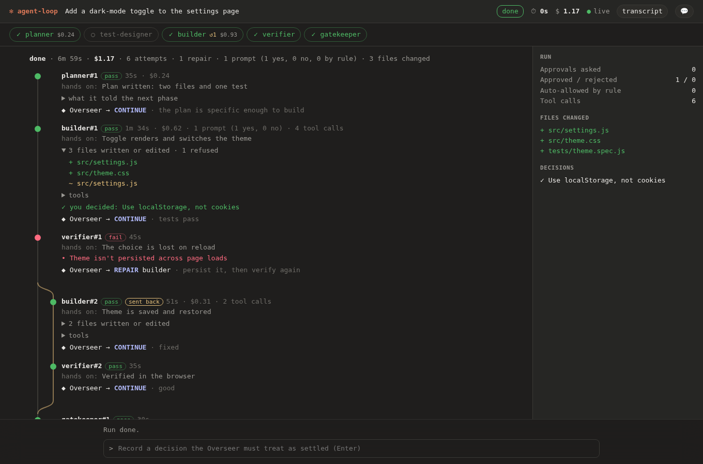

# Lineage: who did what, in what order, and why it was redone

A run is five agents handing work to each other, with the Overseer sending some of it back. The transcript
shows that as a long stream. The lineage shows it as a git-log-like tree: every phase attempt, what it handed
on, which files each agent wrote, what it cost, and where a repair branched off and rejoined.



Open it with the **tree** button in the header (and **transcript** to go back). The same tree is saved with
every run and can be printed for any past one:

```bash
node dist/cli.js lineage [--run <id|prefix|latest>] [--json | --markdown] [--dir <workDir>] [--data-dir <path>]
```

```
Run 9d03e0d9-…  done  6m 59s  $1.17
Task: Add a dark-mode toggle to the settings page

● planner#1        pass         35s · $0.24
│  says: Plan written: two files and one test
│  Overseer → CONTINUE: the plan is specific enough to build
● builder#1        pass         1m 34s · $0.62 · 1 prompt (1 yes, 0 no) · 3 files · 4 tool calls
│  + src/settings.js
│  ~ src/settings.js
│  human decision: Use localStorage, not cookies
● verifier#1       FAIL         45s
│  says: The choice is lost on reload
│  Overseer → REPAIR builder: persist it, then verify again
├─╮
│ ○ builder#2      pass         51s · $0.31  (sent back)
│ ○ verifier#2     pass         35s
├─╯
● gatekeeper#1     pass         30s
```

Every run also writes `lineage.md` (to read) and `lineage.json` (to process) next to its `report.html`, and the
saved report opens straight to the same tree.

**Video** (59 s, captioned): [`docs/media/lineage-tree.mp4`](media/lineage-tree.mp4). A run plays, the Verifier
fails, the Overseer sends it back, then the same run is opened as a tree: the fork and the merge, what each agent
handed on, the files (the refused write is counted, never listed), the per-agent and per-file tables, and the same
tree from the terminal.


## What is in it

- **One node per phase attempt**, in order, with who it was handed on from (its parent) and whether it was a
  plain handoff, a **repair** (the Overseer sent the run back to that phase) or a **retry** of the same phase.
- **Repairs are branches.** A re-run of a phase the run had already reached sits on a second lane, branching
  off the attempt that failed (not off the phase it re-runs) and rejoining where the run gets past where it had
  got to. Going back further than the failing phase is a repair too.
- **What each attempt handed on:** its own headline, its details and concerns, its blocking findings: what the
  next phase was given to read. This is the "all thoughts from each, readable like a chat" the project set out to
  have.
- **Cost, prompts and tool calls per attempt**, browser actions, and desktop actions sent versus stopped.
- **The Overseer's call after it** (continue, repair, stop) and its reasoning.
- **Your decisions**, attached to the attempt they were made against.
- **Made by:** one row per agent (attempts, outcomes, cost, files, tool calls, prompts) and, per file, **who
  touched it, in order**.

## How files are attributed

Only a `Write`, `Edit` or `NotebookEdit` that **succeeded** counts: the call is held until its result arrives, and
a refused or failed one is counted as "refused" and never listed as the agent's work. A write still in flight
when the run ended isn't claimed either. Files changed through `Bash` (a redirect, `npm install`, `git`) can't be
attributed to a path, so Bash calls are counted but their effects are not listed; the markdown says so.

Comparing the tree to the page's older "Files changed" panel found that panel listing a refused write (even one
to a `.env`) as a changed file, because it recorded the attempt. It now waits for the result too.

## Why it is read-only

The research behind this (`docs/RESEARCH-COMPUTER-USE-AND-MULTI-AGENT.md`) found that OpenClaw, which does ship
multi-agent coordination, deliberately has **no shared notebook** that agents write to: a log two agents can
both write reintroduces the races a coordinator-mediated design avoids. The lineage is the other half of that:
it is **derived** from what happened, from events the run already emits, so it cannot disagree with them and
nothing can write to it. It also does not make commits in your repository. A run that changes your git history
on its own is a decision for you to opt into, not a side effect of watching.

## How it works

- `buildLineage(events)` in `src/lineage.ts` is a pure function. The page gets the tree as a `lineage-updated`
  event, published after every moment that changes its shape (a phase starting or ending, the Overseer deciding,
  you recording a decision, the run ending). Only the newest per run is kept in the replay a late tab receives
  and in the saved report, and it is **not stored**: the events it comes from are, and `agent-loop lineage`
  rebuilds the same tree from them (checked: the tree rebuilt from the database equals the one the live run
  showed).
- Everything a model or a page wrote (headlines, reasons, paths, tool names) is cleaned of control and bidi
  characters and capped inside the builder, so a consumer that forgot to escape still can't be handed an escape
  sequence; the page and the terminal escape as well.
- Caps: 400 attempts, 200 files listed per attempt (the rest counted), 300 files in the by-file list, 100
  decisions, 20 distinct tool names per attempt.

## How it was checked

- `test/lineage.mjs`: a straight run, repairs as branches (and further-back repairs, and plain retries),
  attribution (successful writes only, per edit, in order, a denied write, a Bash redirect and an in-flight write
  never claimed), file and cost caps, cost (including non-finite, negative and absurd numbers), approvals
  (credited to the attempt that asked even when answered during a retry; a machine's resolution isn't a human
  answer), hostile text everywhere, malformed events (nulls, duplicates, bad attempt numbers, other runs,
  prototype-named tools), the renderers (no control bytes, no broken tables), the tracker and bus and store (the
  rebuild equals the live tree; a closed store can't crash a run), the command line, and **cross-checks of every
  total against independent counts of the raw events** on realistic 6 to 36 minute runs.
- `test/ui-lineage.mjs`, in a real Chromium: the toggle, rows in order, lanes, the fork and merge, what each
  attempt carries, the tables, a live update, a tab that connects later, a saved report from disk, the clock,
  and hostile strings in a headline, a blocking finding, a file path, a tool name, the Overseer's reason and your
  decision all shown as text, with nothing injected.
- **46 breaks** of the builder, the bus, the page and the command on the built code. Every one is caught now;
  three survived at first and each showed a missing case (an answer arriving during a retry, a reconnect
  clearing an old tree, an unfinished run's clock), which was then added.
- The cross-check also caught a bug in the test simulator itself (it numbered a second attempt twice), which had
  also put "builder, attempt 2" twice into the persona screenshots.

## Limits

- Two lanes: a repair inside a repair stays on the repair lane rather than getting a third.
- It shows what the events say. A phase that wrote a file by a means that isn't a `Write`/`Edit` call is not
  credited with it.
- It does not commit anything, and does not (yet) offer to.
