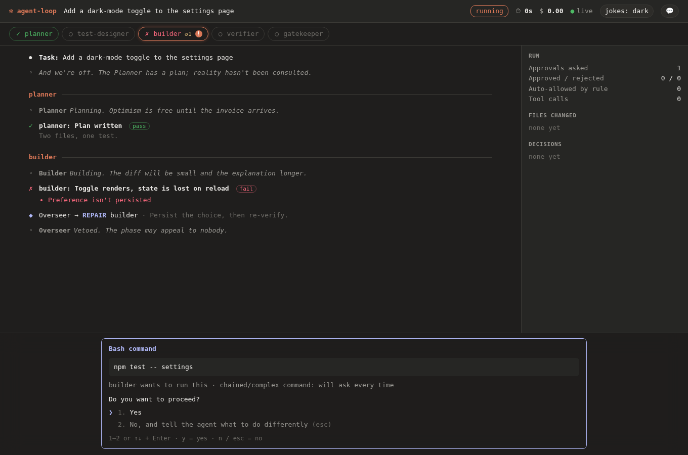
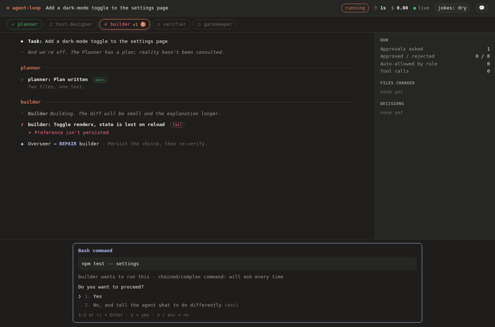

# The voice: agents with a personality, and a leash

A coding agent run is hours of watching text scroll. This gives the run some life: each agent has a
temperament, the Overseer behaves like a legislature with a veto, and the tool comments — with a bit of
bite — on how it is being used. Dry by default, dark if you allow it, never cruel, and **it can be turned off
at three levels**. The code is `src/persona.ts`; the checks that keep it safe are `test/persona.mjs` and
`test/ui-persona.mjs`.

The same run at `jokes: dry` (the dark lines are hidden; the approval prompt never had any):

## Levels

| Level | What you get |
|---|---|
| `off` | Nothing. Plain status lines, no toggle in the page. |
| `dry` | Self-aware dev humor: git, CI, TODOs, the agents' quirks. |
| `dark` (default) | Everything in `dry`, plus mildly dark lines: mortality of processes, code and deadlines ("Checking the claims. Claims have a mortality rate."). |

Set it with `--humor off|dry|dark` or `AGENT_LOOP_HUMOR`. The run's level is a **ceiling**: the web page has a
`jokes:` button that cycles within it (remembered per browser), and can turn the voice down but never up past
what the run was started with. The terminal shows notes only on a TTY unless you pass `--humor` explicitly, so
logs and CI stay plain. `agent-loop insights` ends with a line that follows your numbers, under the same rule.

## Who is talking

| Who | Temperament |
|---|---|
| Planner | optimist with a spreadsheet |
| Test Designer | pessimist, usually right |
| Builder | ships first, explains later |
| Verifier | trust issues, professionally |
| Gatekeeper | a bouncer with a checklist |
| Overseer | holds the veto and uses it (vetoes, amendments, points of order, motions carried or tabled) |

A phase's opening line is in its own voice; the Overseer's decisions sound like a legislature. Hover a name in
the page, or the phase in the stepper, for its tagline. "Politics" here means **the process** of a
legislature (veto, filibuster, committee, quorum), never a side, a party or a person.

## What it comments on

| When | Examples of what triggers it |
|---|---|
| The run | start; done clean; done after *n* repairs; failed; stopped |
| Each phase | its opening line (first attempt only); pass; fail |
| The Overseer | continue; repair (the veto); stop |
| How you use it | a refusal (and the third in a row); five approvals in a blink ("Did you read it, or did you feel it?"); a long wait before you answered; a "don't ask again" rule saved, and the third one; every `$1`, `$5`, `$20` |
| Tools | the browser starting; the desktop window locked; a desktop action stopped by a fence |
| `insights` | no runs yet; more failures than successes; most runs needing repairs; you deny more than you approve; plenty of approvals and zero denials; many saved rules |
| Idle page | 20 rotating lines (10 dry, 10 dark) |

It is a seasoning, not a flood: at least 6 seconds between notes, at most 30 a run; one-off moments (a cost
threshold, the speed-approval quip, a saved rule) fire once; the ending always speaks. Choices are deterministic from the run id, so a run's commentary is
reproducible and never the same line twice in a row.

## The target of the jokes

The agents, the process, git, CI, the tool, and **how you use the tool** — that last one is where the bite
is: speed-approving, never denying, hoarding standing rules. Never your identity, looks, intelligence or health;
never real people, parties, religion, groups, self-harm, violence toward people, or real tragedies. The rule
of thumb is that a joke should still be fine read aloud to the person it teases. Teasing about what you did
in the tool is on the menu; teasing about who you are is not.

## Hard rules, and what enforces them

| Rule | How it's enforced |
|---|---|
| **It never reaches a model.** A joke can't change what an agent does or says | Only `cli`, `server`, `report` and `terminal` import the persona; the phases, Overseer, hooks, pipeline and both tool sets don't mention it. `test/persona.mjs` checks the import graph (and that the check can see an import) |
| **It never carries untrusted text.** Nothing a page, window, file or model wrote can land in a note | Lines are a fixed catalog; the only interpolations are an enum phase name and validated numbers. The director reads only enumerated event fields. A test stuffs hostile text into every free-text field of every event type and asserts every note is still exactly a catalog line |
| **It is never inside an approval.** Not in the prompt, the action text or a refusal reason | Notes are separate, dimmed lines after the event they follow. `test/ui-persona.mjs` opens a real approval prompt at level `dark` with notes on screen and checks it contains none of the catalog's lines and no persona element |
| **A bad line can't get in.** | `lintCatalog()` checks length, duplicates, control/bidi/zero-width characters, unknown placeholders and a list of banned terms (people, parties, groups, tragedies, slurs-by-category), and requires every moment to have a dry line. The test proves the lint catches each kind (control lines) |
| **Off means off, and the page can't override the run.** | `--humor off` attaches nothing and hides the toggle; a stored "dark" can't lift a "dry" ceiling (tested) |
| **It can't break a run.** | Notes are emitted after the triggering event has reached every listener, and a failure (a closed database, say) is swallowed. Tested with the store closed mid-run |
| **Tampered notes are inert.** | The page escapes them and looks speakers up by own property; the terminal strips control bytes. Tested with markup, `__proto__` and `constructor` as speakers |

Every one of these was also broken on purpose (terminal stripping, the phase check, the dry filter, the gap,
the cap, event ordering, the report's inline data, the server leaking a task, the import rule, the CSS that
hides dark notes, escaping, the own-property check, the ceiling, the stored-level check, a note inside the
dock) and each break failed a test. Two survived at first — a test of automatic approvals that could never
have produced a note, and one that looked for `[object` when the bug would print `Object` — and were
strengthened until the mutation was caught.

## Adding a line

1. Put it in `CATALOG` in `src/persona.ts` under the moment it belongs to, with `d(...)` for dark, `l(...)` for dry.
2. Keep it under 120 characters, one sentence or two short ones. Placeholders are `{phase}`, `{n}`, `{cost}` only.
3. Ask: would it be fine read aloud to the person it teases? Is the target the process, the tool or the
   agents, or how the tool is used — not the person? No real people, parties, religion, groups, self-harm or
   tragedies.
4. `npm run test:persona` — the lint must stay clean. The lint is a net for contributions, not a substitute
   for reading the line.
5. A new moment needs a trigger in `PersonaDirector.onEvent`, which may read event types, enum fields,
   numbers and timestamps, **never free text**; and a test case in `test/persona.mjs`.

## What this is not

- **Not generated by a model.** Generating jokes would cost money per run, vary run to run, and be able to be
  steered by what's on the screen. A fixed catalog is predictable, free and reviewable. The price is that it
  repeats across many runs; 146 lines across 35 moments is the current answer, and more lines are cheap to add.
- **Not a judge of what's funny.** Humor is subjective; the tests check that the voice is safe and switchable,
  not that it lands. If a line doesn't land for you, say which and it goes.
- **Not in the saved report's facts.** Notes are events like any other and appear in a saved report (with the
  same toggle), but they are never counted in insights and never treated as data about the run.
