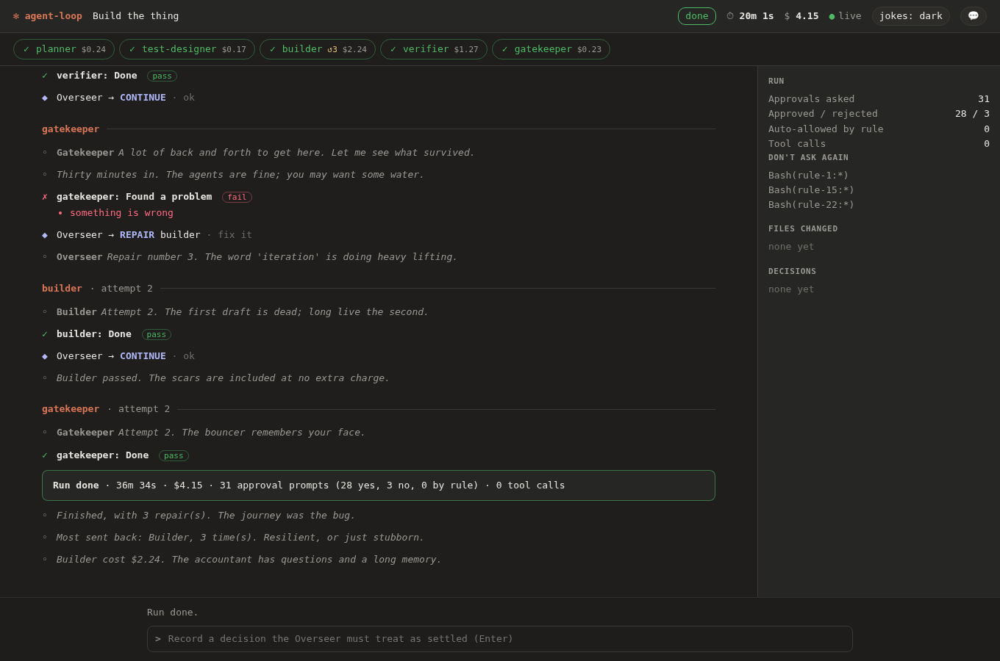
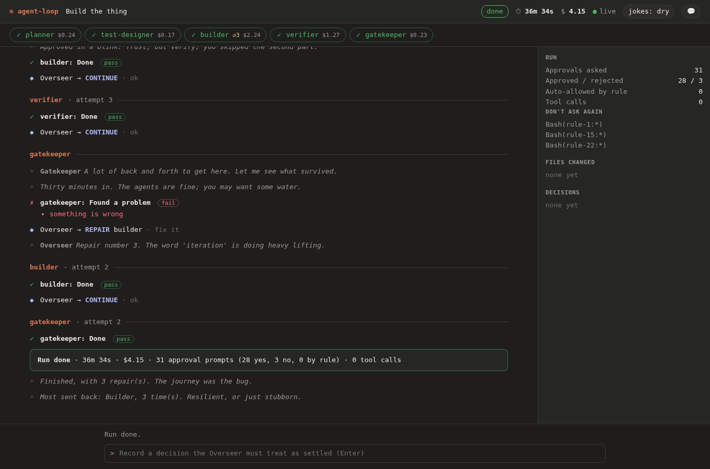

# The voice: agents with a personality, and a leash

A coding agent run is hours of watching text scroll. This gives the run some life: each agent has a
temperament, the Overseer behaves like a legislature with a veto, and the tool comments — with a bit of
bite — on how it is being used. Dry by default, dark if you allow it, never cruel, and **it can be turned off
at three levels**. The code is `src/persona.ts`; the checks that keep it safe are `test/persona.mjs` and
`test/ui-persona.mjs`.

A run part-way through (a 36-minute run with three vetoes, simulated from the shape of real runs). The
Overseer vetoes and the Builder replies; an approval prompt waits at the bottom with none of it in:

The end of the same run: the ending, then the awards the run's own numbers earned:

And at `jokes: dry`, where the dark lines are hidden:

## Levels

| Level | What you get |
|---|---|
| `off` | Nothing. Plain status lines, no toggle in the page. |
| `dry` | Self-aware dev humor: git, CI, TODOs, the agents' quirks. |
| `dark` (default) | Everything in `dry`, plus mildly dark lines: mortality of processes, code and deadlines ("Checking the claims. Claims have a mortality rate."). |

Set it with `--humor off|dry|dark` or `AGENT_LOOP_HUMOR`. The run's level is a **ceiling**: the web page has a
`jokes:` button that cycles within it (remembered per browser), and can turn the voice down but never up past
what the run was started with. The terminal shows notes only on a TTY unless you pass `--humor` explicitly, so
logs and CI stay plain. `agent-loop insights` ends with a line that follows your numbers, under the same rule.

## Who is talking

| Who | Temperament |
|---|---|
| Planner | optimist with a spreadsheet |
| Test Designer | pessimist, usually right |
| Builder | ships first, explains later |
| Verifier | trust issues, professionally |
| Gatekeeper | a bouncer with a checklist |
| Overseer | holds the veto and uses it (vetoes, amendments, points of order, motions carried or tabled) |

A phase's opening line is in its own voice; the Overseer's decisions sound like a legislature. Hover a name in
the page, or the phase in the stepper, for its tagline. "Politics" here means **the process** of a
legislature (veto, filibuster, committee, quorum), never a side, a party or a person.

## What it comments on

| When | What it says |
|---|---|
| The run starts | an opening line; or, when the clock says so, one about the hour (the middle of the night, an early start, a Friday afternoon, a weekend) |
| Each agent's turn | the agent introduces itself in its own voice, and from the second agent on it reacts to the one before ("Builder says it works. Builder says a lot of things.") |
| A phase is sent back | the Overseer vetoes (an amendment, a point of order, a motion tabled) and the agent sent back **replies** ("Back again, attempt 3, with feedback and mild resentment."). From the third veto the Overseer counts them |
| A phase passes | rarely, and in a different voice once the run has been through repairs |
| How you use it | a refusal, and the third in a row; five approvals in a blink ("Did you read it, or did you feel it?"); a long wait before you answered; a "don't ask again" rule saved, and the third; prompt number 25 and 50 |
| How long and how much | half an hour in, an hour in; the 100th and 250th tool call; every $1, $5, $20 |
| Tools | the browser starting; the desktop window locked; a desktop action stopped by a fence |
| The ending | clean, repaired, failed or stopped, then up to two **awards** from the run's own numbers: your average answer time (fast or slow), who was sent back most, who cost the most, who called the most tools, or a run with no prompts at all. Your habits come first |
| `insights` | no runs yet; more failures than successes; most runs needing repairs; you deny more than you approve; plenty of approvals and zero denials; many saved rules |
| The idle page | 20 rotating lines (10 dry, 10 dark) |

Lines can depend on how the run has gone: some are only for a clean run ("Suspiciously smooth.", "Everyone
before me said yes"), some only after repairs ("A lot of back and forth to get here."), so an agent never
says the first after three vetoes.

### Pacing: what speaks

A real run is minutes long with dozens of events a minute, so what speaks is chosen, and it was chosen wrong
the first time. Replaying realistic runs through the first version (a flat minimum gap between notes) showed
that **none of the agents' own opening lines and none of the Overseer's vetoes were ever heard**: they come a
fraction of a second after the previous note, so the gap swallowed exactly the lines that carry the
personality, while the generic "X passed" filler took the slots. So now:

- **Key moments** (an agent's opening line, a retry, a veto, a refusal streak, a speed-approval or slow-answer
  callout, the ending, the awards) always speak, up to a cap of 40 a run, and may come in pairs.
- **Seasoning** (a pass, a saved rule, a cost or tool-count milestone, a long-run mark) needs 20 seconds since
  the last note, is capped at 12 a run, and several kinds are skipped most of the time (a pass speaks about a
  third of the time). A missed milestone isn't spoken late.
- A template is not repeated within a run until all of that moment's templates have been used.

Choices are deterministic from the run id, so a run's commentary is reproducible.

## The target of the jokes

The agents, the process, git, CI, the tool, and **how you use the tool** — that last one is where the bite
is: speed-approving, never denying, hoarding standing rules. Never your identity, looks, intelligence or health;
never real people, parties, religion, groups, self-harm, violence toward people, or real tragedies. The rule
of thumb is that a joke should still be fine read aloud to the person it teases. Teasing about what you did
in the tool is on the menu; teasing about who you are is not.

## Hard rules, and what enforces them

| Rule | How it's enforced |
|---|---|
| **It never reaches a model.** A joke can't change what an agent does or says | Only `cli`, `server`, `report` and `terminal` import the persona; the phases, Overseer, hooks, pipeline and both tool sets don't mention it. `test/persona.mjs` checks the import graph (and that the check can see an import) |
| **It never carries untrusted text.** Nothing a page, window, file or model wrote can land in a note | Lines are a fixed catalog; the only interpolations are an enum phase name and validated numbers (a whole number up to 9999, a cost from 0 up to a million). The director reads only enumerated event fields: types, phase names, decisions, costs, counts and timestamps. A test stuffs hostile text into every free-text field of every event type and asserts every note is still exactly a catalog line |
| **It is never inside an approval.** Not in the prompt, the action text or a refusal reason | Notes are separate, dimmed lines after the event they follow. `test/ui-persona.mjs` opens a real approval prompt at level `dark` with notes on screen and checks it contains none of the catalog's lines and no persona element |
| **A bad line can't get in.** | `lintCatalog()` checks length, duplicates, control/bidi/zero-width characters, unknown placeholders and a list of banned terms (people, parties, groups, tragedies, slurs-by-category), and requires every moment to have a dry line. The test proves the lint catches each kind (control lines) |
| **Off means off, and the page can't override the run.** | `--humor off` attaches nothing and hides the toggle; a stored "dark" can't lift a "dry" ceiling (tested) |
| **It can't break a run.** | Notes are emitted after the triggering event has reached every listener, and a failure (a closed database, say) is swallowed. Tested with the store closed mid-run |
| **Tampered notes are inert.** | The page escapes them and looks speakers up by own property; the terminal strips control bytes. Tested with markup, `__proto__` and `constructor` as speakers |

Every one of these was also broken on purpose (terminal stripping, the phase check, the dry filter, the gap,
the cap, event ordering, the report's inline data, the server leaking a task, the import rule, the CSS that
hides dark notes, escaping, the own-property check, the ceiling, the stored-level check, a note inside the
dock) and each break failed a test. Two survived at first — a test of automatic approvals that could never
have produced a note, and one that looked for `[object` when the bug would print `Object` — and were
strengthened until the mutation was caught.

## Adding a line

1. Put it in `CATALOG` in `src/persona.ts` under the moment it belongs to, with `d(...)` for dark, `l(...)` for dry.
2. Keep it under 120 characters, one sentence or two short ones. Placeholders are `{phase}`, `{n}`, `{cost}` only.
   If it only makes sense in a clean run or after repairs, wrap it in `clean(...)` or `repaired(...)`.
3. Ask: would it be fine read aloud to the person it teases? Is the target the process, the tool or the
   agents, or how the tool is used — not the person? No real people, parties, religion, groups, self-harm or
   tragedies.
4. `npm run test:persona` — the lint must stay clean. The lint is a net for contributions, not a substitute
   for reading the line.
5. A new moment needs a trigger in `PersonaDirector.onEvent`, which may read event types, enum fields,
   numbers and timestamps, **never free text**; a decision about whether it is key or seasoning; and a test case
   in `test/persona.mjs`.
6. Replay the realistic runs and read them: `node --experimental-sqlite test/persona-sim.mjs` is the simulator,
   and `test/persona.mjs` asserts what they must contain. Reading the output caught what the unit tests did not.

## How it was evaluated

The first version was tested for safety and shipped. Then it was run against something with the shape of a real
run: `test/persona-sim.mjs` generates deterministic event streams from numbers recorded in real runs (about 6
minutes, 11 approvals and $1.40 for a typical one; a 36-minute run with three vetoes; a person approving 25
prompts in under a second each; a failing run; a run started at 2:40 in the morning). Replaying them found,
before anything was changed:

- **The agents' own voices and the Overseer's vetoes were never heard** (the gap rule, above).
- **Most of what did speak was the generic "X passed" line**, five of seven notes in a typical run.
- **The same template twice in a run** ("Enjoy it; it's a loan" for two different phases).
- **A line that was wrong for the run's history** ("Everyone before me said yes" after three vetoes).
- **Nothing noticed the hour, the length of the run, or how much it had done.**

All of that is fixed and each fix has a test that replays those runs. The tests assert the shape (every agent
speaks, every veto is answered, no template twice, none silent, none a flood at 3 a minute, dry never dark),
not the wording. Whether it is funny is still a person's call.

Mutations: 18 breaks of the pacing, awards, retries, milestones and clock logic on the built code. 13 were caught
(one only after I fixed my own mutation script). Five survived and were dealt with: two guards were redundant,
because another check already rejects the same input, so the dead branches were deleted; one more (the phase-name
check) is redundant for the same reason but kept as a type guard; and two tests were too weak (an exact
100th-call boundary, and hostile costs reaching a milestone) and were strengthened until the break was caught.

## What this is not

- **Not generated by a model.** Generating jokes would cost money per run, vary run to run, and be able to be
  steered by what's on the screen. A fixed catalog is predictable, free and reviewable. The price is that it
  repeats across many runs; 209 lines across 56 moments is the current answer, and more lines are cheap to add.
- **Not a judge of what's funny.** Humor is subjective; the tests check that the voice is safe and switchable,
  not that it lands. If a line doesn't land for you, say which and it goes.
- **Not in the saved report's facts.** Notes are events like any other and appear in a saved report (with the
  same toggle), but they are never counted in insights and never treated as data about the run.
