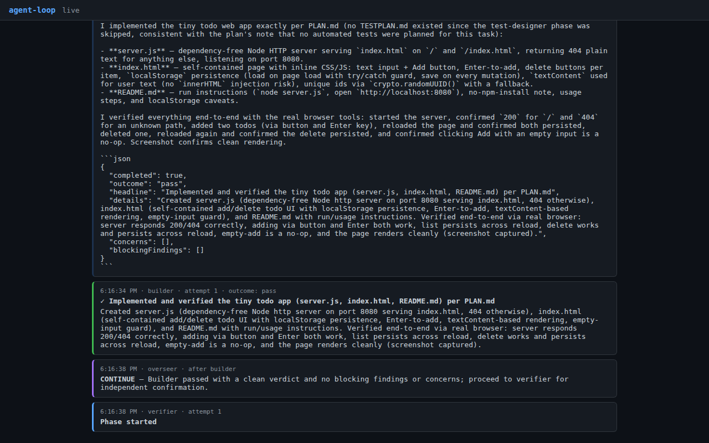
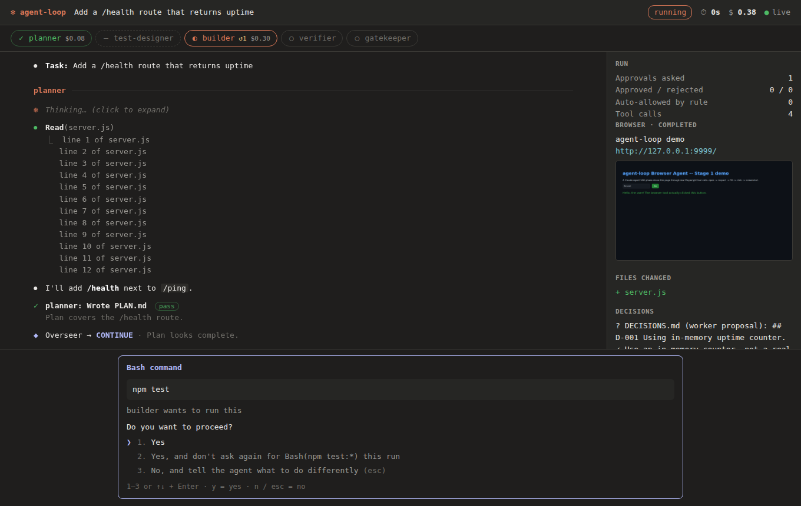
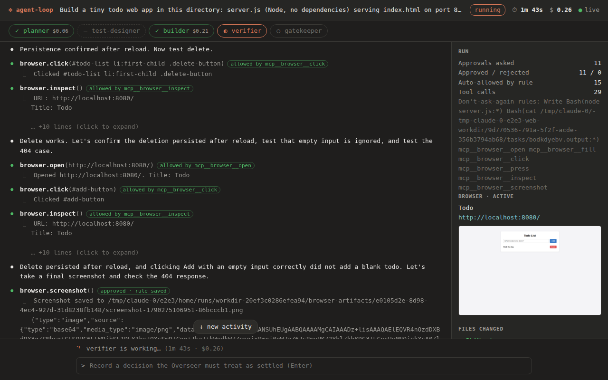
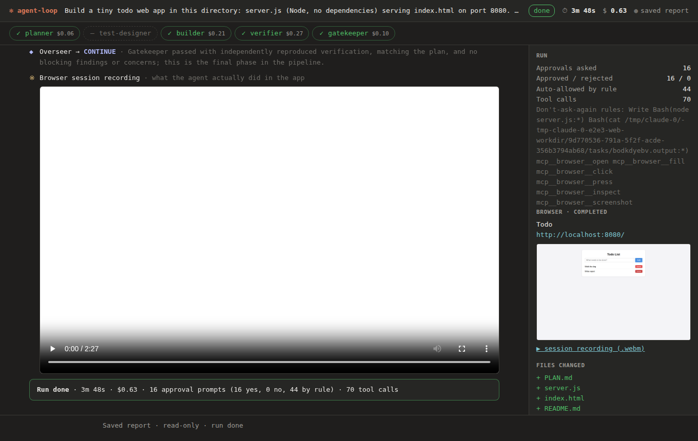

# The run UI: what was broken, and how it works now

Every number and picture here comes from real runs of `agent-loop run` against the real model, with a
real Chromium clicking the real UI (`test/e2e/record-run.mjs`), graded afterwards by hidden tests the
agents never saw. Recorded 2026-09-24.

## What changed, in numbers

Same task both times: *"Build a tiny todo web app: server.js serving index.html on port 8080, add /
delete todos, keep them in localStorage."* The same Roman-numeral task ran alongside it as a second
data point.

| | Old UI | New UI |
| --- | --- | --- |
| Approval prompts, todo app | 53 | **16** |
| Approval prompts, Roman numerals | 24 | **11** |
| Things on screen, todo app | 356 cards | **103** blocks |
| Where the Approve button is | somewhere in 356 cards | **always at the bottom** |
| Answer without the mouse | no | **1 / 2 / 3, y / n, Esc** |
| Cost shown | nowhere | **header + per phase** |
| Tab reloaded mid-run | transcript gone | **whole transcript replayed** |
| After the run ends | page goes blank, nothing saved | **transcript stays + `report.html` saved** |
| What the agent did in the browser | one screenshot | **full video of its session** |
| Answer from the terminal | no | **yes, same prompt** |
| Output quality (hidden graders) | 9/9 · 4,040/4,040 | 9/9 · 4,040/4,040 |

The code the agents wrote was already good. What made the tool unusable was everything around it.

## Where the old UI broke down



Video (real run, 5× speed): [`media/before-old-ui-real-run-5x.webm`](media/before-old-ui-real-run-5x.webm)

1. **Every event was its own card.** One browser click showed up five times: the tool call, "browser
   action started", "browser action completed", the tool result, then "Approval allow". A 4-minute
   run produced 356 cards.
2. **The Approve button scrolled away.** It sat inside whichever card asked, mid-stream. With a
   burst of tool calls you had to hunt for it, and nothing but a banner said anything was waiting.
3. **53 clicks for a todo app.** Every Bash call asked, including `ls`, `cat`, `grep` and
   `curl localhost`, and so did every browser click. Approving `npm test` once didn't help the
   next time.
4. **Raw data everywhere.** Each phase's verdict appeared twice, once as a raw ```` ```json ```` block
   and again as the parsed card. Tool inputs were pretty-printed JSON. File paths were absolute.
5. **No sense of progress.** No phase overview, no cost, no timer, so you couldn't tell whether a
   run was nearly done or which phase was repairing.
6. **Nothing survived.** Reloading the tab mid-run showed an empty page, apart from any approval
   still waiting. When the run ended the server shut down, and the page's reconnect cleared the
   transcript. There was no record to look at afterwards except the SQLite file.
7. **Browser only.** The terminal printed three lines of setup and then went silent for the whole
   run.

## How it works now

The design copies Claude Code's own terminal UI on purpose. It's the interface people already
know for "an agent is working, and sometimes needs a yes/no from me."



- **One line per tool call:** `⏺ Bash(npm test)`, with its output attached underneath as
  `⎿ …`, cut to 3 lines plus "+N lines (click to expand)". Paths are relative to `--dir`. Browser
  tools read `browser.click(#add-button)`.
- **The permission prompt is pinned to the bottom**, in the same shape as Claude Code's:
  ```
  Bash command
    npm test
  builder wants to run this
  Do you want to proceed?
  ❯ 1. Yes
    2. Yes, and don't ask again for Bash(npm test:*) this run
    3. No, and tell the agent what to do differently (esc)
  ```
  Keys `1`/`2`/`3`, `y`/`n`, `↑↓`+Enter and Esc all work. Option 3 opens a text box; what you type
  goes back to the agent as the reason. `Write` shows the file as `+` lines and `Edit` shows
  `-`/`+`. The tab title shows `(1) approval needed`.
- **A phase stepper**, `planner ✓ $0.06 · test-designer – · builder ◐ ↺1 · verifier ○ ·
  gatekeeper ○`, shows each phase's state, cost and repair count. Click a step to jump to it.
- **The header** shows the task, run status, elapsed time, total cost and connection state.
- **A side panel** shows approval counts, saved "don't ask again" rules, the live browser (page
  title, URL, latest screenshot), files changed, and decisions (worker proposals vs. ones you
  recorded).
- **The bottom input** takes a trusted decision whenever nothing is waiting: type it and press
  Enter.



Video (real run, 5× speed): [`media/after-new-ui-real-run-5x.webm`](media/after-new-ui-real-run-5x.webm)

This real-run screenshot is also how the next bug turned up. The agent's `screenshot` tool returned
its image as base64, and that base64 went straight into the transcript (bottom of the picture). Image
blocks now show as `[image]`; the picture itself is in the browser panel.

### Fewer prompts, without approving blindly

Two changes took the todo app from 53 prompts to 16. Both follow Claude Code's own permission rules.

- **"Yes, and don't ask again" (option 2)** saves a rule for the rest of the run only:
  `Bash(npm test:*)` for shell commands, or the tool name for file and browser tools. File tools are
  already confined to `--dir` by the path-scope hook. A rule is as narrow as what you saw:
  `npm test` does not cover `npm publish`, and `npm run build` does not cover `npm run deploy`.
- **Read-only shell commands inside `--dir` don't ask**, the same way `Read`/`Glob`/`Grep` never
  did: `ls`, `cat`, `grep`, `git status`, `curl` to localhost, `cd` inside the project, and similar.
  A compound command (`cd … && ls && curl localhost:8080`) is split into its parts and each part is
  judged on its own (`src/bash-analysis.ts`). Pass `--strict-approval` to be asked about every
  shell command anyway.

What never becomes a rule, and always asks:

- `rm`, `kill`/`pkill`, `chmod`, `mv`/`cp`, `sed`, `find`, `tee`
- `git push/reset/clean/checkout/config`
- `curl`/`wget` to anywhere but localhost, `ssh`
- `sudo`/`env`/`xargs`/`bash`, and interpreters' inline code (`python3 -c`, `python3 -O -c`,
  `node -e`)
- anything with `$(…)`, backticks, heredocs, or output redirected to a file
- any command whose words expand at run time (`cat $F`)
- a command after a `cd` that leaves `--dir`

`test/bash-analysis.mjs` checks 15 real commands agents ran in these recordings and 36 adversarial
ones. Two of those adversarial cases were real holes found while building this: `cat $F` would have
produced a rule matching whatever `$F` held, and `python3 -O -c "…"` would have produced
`Bash(python3 -O:*)`, allowing any inline Python after `-O`. Both are closed and tested.

### The terminal is a real interface too

The terminal shows the same transcript and the same prompt, so a run can be driven without ever
opening the browser. Whichever side answers first wins; the other moves on.

```
builder ─────────────────────────────────────────────────────────────
⏺ Read(server.js)
  ⎿  const http = require("http"); … +22 lines
⏺ Bash(npm test)

╭─ Bash command
│   npm test
│ builder wants to run this
│ Do you want to proceed?
│ ❯ 1. Yes
│   2. Yes, and don't ask again for Bash(npm test:*) this run
│   3. No, and tell the agent what to do differently
╰─ press a number (y = yes, n = no) · or answer in the web UI
  ⎿  approved · won't ask again for Bash(npm test:*)
✗ builder: Tests fail (fail)
  • test_health fails
◆ Overseer → REPAIR builder · fix the failing assertion
```

### Every run leaves a record you can open later

When the run ends, `agent-loop` writes `report.html`: the same UI with the run's events embedded,
next to its screenshots and video. The CLI prints the path. It opens straight from disk, with no
server and no token.



With `--browser`, the agent's browser session is recorded as video. That's a watchable record of
what it actually did to the app, not just its claims about it. Example (real run, 2× speed):
[`media/agent-browser-session-2x.webm`](media/agent-browser-session-2x.webm).

## Checking it yourself

```bash
npm run build && npm test            # 11 suites, no API key; includes a real-Chromium UI test
node test/e2e/record-run.mjs --out /tmp/rec --browser --smart -- "Build a tiny todo web app…"
                                     # real run (≈$0.60–1.60): video, screenshots per phase, summary.json
```

`test/ui-render.mjs` drives the real page in a real Chromium. It checks the stepper, cost, collapsed
output and keyboard approval (`2` = don't ask again, `n` + typed reason = reject). It also checks that
a reload replays everything and that the transcript survives the server shutting down.

## Still not done

- A rejected call can't be edited and re-run in place, the way Claude Code lets you amend a
  command. Your only options are yes, or no plus a reason.
- `Bash` is still not path-scoped. `cat ~/.ssh/id_rsa` asks every time now, but nothing forbids it
  once approved. That needs a real sandbox.
- The pipeline still doesn't pause to ask you a question. A contradiction ends the run and you
  restart it with the decision recorded.
- Videos are WebM, which GitHub won't play inline. Download them to watch.
